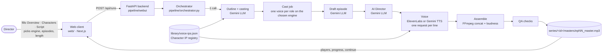
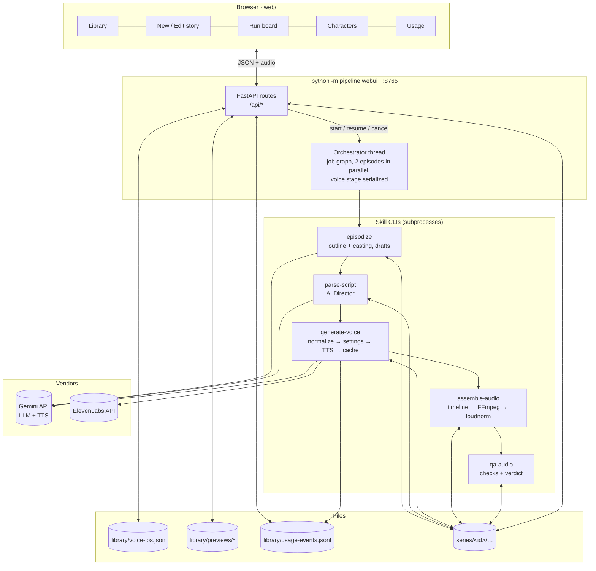

# Audio AI Studio

Turns one Vietnamese story into a series of short, mastered audio episodes (about 50 to 70 seconds
each) voiced by a fixed cast of AI **Character IPs**, so audience retention can be measured before
any video is produced.

The system is a Python pipeline of six stages driven by an orchestrator, a FastAPI JSON API, and a
Next.js web client. Every stage reads and writes plain files with deterministic names, so any step
can be re-run alone, inspected, or edited by hand.

- Language: Vietnamese first (`vi-VN`), prompts and content included.
- Writer and Director: Google Gemini with structured (Pydantic-validated) output.
- Voices: two engines, chosen per run. **ElevenLabs** carries the Character IP voices; **Gemini TTS**
  offers 30 fixed prebuilt voices addressed by name.
- No narrator, no background music, no sound effects in this phase: clean speech, one master per episode
  at -16 LUFS, delivered as WAV and MP3.

Related documents: [docs/ARCHITECTURE.md](docs/ARCHITECTURE.md) (stage internals and prompts),
[docs/SETUP.md](docs/SETUP.md) (accounts, keys, pricing, live findings),
[docs/IMPLEMENTATION_PLAN.md](docs/IMPLEMENTATION_PLAN.md) (decisions and phases),
[CLAUDE.md](CLAUDE.md) (conventions for contributors and coding agents), [web/README.md](web/README.md) (client and hosting).

---

## Table of contents

1. [How it works at a glance](#1-how-it-works-at-a-glance)
2. [Architecture](#2-architecture)
3. [Step by step: from pasted story to master](#3-step-by-step-from-pasted-story-to-master)
4. [Running the application](#4-running-the-application)
5. [Configuration](#5-configuration)
6. [Where files are stored](#6-where-files-are-stored)
7. [API reference](#7-api-reference)
8. [Command-line tools](#8-command-line-tools)
9. [Web client](#9-web-client)
10. [Usage, limits and cost](#10-usage-limits-and-cost)
11. [Testing and troubleshooting](#11-testing-and-troubleshooting)

---

## 1. How it works at a glance



In words: the director pastes a story and describes its characters in the browser, optionally
pinning a Character IP to a role. One LLM call plans the episodes and casts every role onto a
registry actor. For each episode the pipeline drafts a screenplay, has an AI Director annotate every
line (emotion, intensity, pace, tags), renders each line with the actor's voice on the selected
engine, concatenates and normalizes the stems into a master, and runs QA checks. The web client
shows the run like a CI board and keeps every story in a library from which production can be
continued later.

## 2. Architecture

### 2.1 Components

| layer | what it is | where |
|---|---|---|
| Web client | Next.js 16 app (TypeScript, Tailwind 4). Pages: Library, New/Edit story, Run, Characters, Usage. Statically exported and served by the backend, or run with `npm run dev`, or deployed to Vercel. | `web/` |
| API | FastAPI app: runs, story library, character registry, previews, usage. Serves `web/out` at `/`. | `pipeline/webui/app.py` |
| Orchestrator | Builds the job graph for a run and executes each job as a subprocess of a skill CLI; writes state after every transition. | `pipeline/orchestrator.py` |
| Skills (stages) | One CLI per stage in the `anthropics/skills` layout (`SKILL.md` + `scripts/<name>.py`). They never call a vendor SDK directly. | `.claude/skills/*` |
| Shared package | Contracts (`schema.py`), paths (`naming.py`), settings (`config.py`), LLM client, TTS providers, Vietnamese normalizer, casting, registry, previews, story index, usage monitor. | `pipeline/` |
| Data | Global Character IP registry, cached previews, usage events; one folder per series with inputs, intermediates, outputs, logs and run state. | `library/`, `series/` |

### 2.2 System flow



Design rules that hold everywhere:

- **Files are the interface.** Every stage boundary is a JSON or text file validated by a Pydantic
  model in `pipeline/schema.py`; paths and stem names come only from `pipeline/naming.py`.
- **Idempotent stages.** Drafts and parsed scripts are overwritten only with `--force`; a stem is
  re-rendered only when the hash of (engine, model, voice, final text, settings) changes; masters
  and QA are always recomputed from what is on disk.
- **Roles versus actors.** A *role* is a character in the story ("Tô Mạn"); an *actor* is a
  Character IP in the registry ("ngan"). Casting maps roles to actors; one actor plays one role per
  series. Stems are named by actor id.
- **Locked registry.** Changing an IP asset's voice needs an explicit unlock and is written to a
  changelog. Previews are rendered once per engine, model and voice, then cached.
- **Every paid call is logged** to the series ledger, and every vendor refusal (429/402) to a global
  event log, which the Usage page reads.

## 3. Step by step: from pasted story to master

| # | stage | job in the run board | input | what happens | output |
|---|---|---|---|---|---|
| 0 | Input | — | web form | Overview (name, length, genre, setting), one row per character (name, description, optional Character IP or `/actor` tag), the script, engine and model, episodes and length. The API rejects an IP pinned to two roles. | `series/<id>/story.json`, `story_raw.txt` |
| 1 | Outline + casting | `outline` | story, registry | One Gemini call returns the premise, tone, protagonist, a casting table (user pins kept, the rest chosen by gender, age, personality and voice description, one actor per role, `null` if nothing fits) and N episode plans with cliffhangers. Mode is `segment` when a full script was pasted (dialogue kept verbatim) or `write` when a treatment was pasted. | `series/<id>/series.json` |
| 2 | Cast | `cast` | bible, registry | Every cast actor gets a voice on the run's engine: uncast roles become one-off registry entries with placeholder voices; IP actors missing a voice on the engine get one auto-assigned. Voices are never shared between two roles. | registry updates, casting table in run state |
| 3 | Draft | `epNN.draft` | plan, script | One Gemini call per episode (structured `EpisodeDraft`, rendered to screenplay text). Segment mode copies lines word for word and verifies it (one retry); write mode enforces a word floor of `min_sec × 3.3`. | `scripts/raw/epNN.txt` |
| 4 | Direct | `epNN.direct` | raw script, casting table | The AI Director maps speakers to actor ids and adds per line: type (dialogue / monologue / pause), `tts_text` with approved audio tags, emotion, intensity 1–10, acoustic direction, pace, volume, pause after. Validated client-side. | `scripts/parsed/epNN.json` |
| 5 | Voice | `epNN.voice` | parsed script, registry | Per line: Vietnamese normalizer → engine settings (ElevenLabs: stability/similarity/style from intensity; Gemini: a Vietnamese acting direction prefixed to the text) → TTS → WAV 44.1 kHz mono + sidecar. Cached by content hash. ElevenLabs 402 on a voice falls back to the actor's premade fallback and is flagged. | `stems/epNN/*.wav` + `.meta.json` |
| 6 | Assemble | `epNN.assemble` | stems, parsed script | Timeline from measured durations (Director pauses clamped to 300–500 ms, 800 ms between scenes, 500 ms tail), FFmpeg concat, two-pass loudnorm to -16 LUFS / -1.5 dBTP stereo, MP3 192 kbps. | `timelines/epNN_timeline.json`, `masters/epNN_master.wav`, `.mp3` |
| 7 | QA | `epNN.qa` | master, stems | Stems complete, duration versus target, loudness and true peak; a list of lines a human should listen to first; optional human verdict. Failed checks show as a warning, not a failure. | `qa/epNN_report.json` |

Continuing a series later ("Continue producing" in the Library, or `--only` on the CLI) runs the
same graph for the remaining episode numbers: the outline and existing drafts are kept, stems come
from cache, masters and QA are recomputed.

## 4. Running the application

### 4.1 Requirements

- Python 3.11 or newer, FFmpeg and ffprobe on `PATH` (`brew install ffmpeg` on macOS).
- Node.js 20 or newer (only to build or develop the web client).
- A Gemini API key (LLM and Gemini TTS). An ElevenLabs API key for the Character IP voices; give the
  key the `user_read` scope so the Usage page can read the vendor's credit counter.

### 4.2 First-time setup

```bash
git clone <this repo> ai-audio && cd ai-audio
python3 -m venv .venv && .venv/bin/pip install -e ".[dev]"
cp .env.example .env            # fill in GEMINI_API_KEY and ELEVENLABS_API_KEY
cd web && npm install && npm run export && cd ..   # builds the web client into web/out
```

### 4.3 Start

```bash
.venv/bin/python -m pipeline.webui             # API + web app at http://127.0.0.1:8765
.venv/bin/python -m pipeline.webui --port 9000 # another port; --host 0.0.0.0 to reach it from other devices
```

Open http://127.0.0.1:8765. The Library is the home page; **New story**, **Characters** and
**Usage** are in the header. Stop with Ctrl+C. If a port is still held by an old instance:
`pkill -f pipeline.webui`.

Runs execute inside the server process. If the server stops mid-run, the run is marked cancelled at
the next start and the Library's "Continue producing" resumes from the cached artifacts.

### 4.4 Web client development

```bash
cd web
npm run dev          # http://localhost:3000, proxies /api/* to API_BASE (default http://127.0.0.1:8765)
npm run export       # rebuild the static bundle served by the backend
npm run typecheck
```

### 4.5 Command line, without the browser

```bash
# whole pipeline for a new series (story as text or StoryInput JSON)
.venv/bin/python -m pipeline.orchestrator --series s1 --story story.txt --episodes 30 --produce 5 --min-sec 50 --max-sec 70 --tts gemini
# continue an existing series
.venv/bin/python -m pipeline.orchestrator --series s1 --only 6-10 --tts elevenlabs
```

Individual stages are listed in [section 8](#8-command-line-tools).

## 5. Configuration

All settings come from `.env` through `pipeline/config.py`; nothing reads the environment directly.

| variable | default | meaning |
|---|---|---|
| `GEMINI_API_KEY` | — | Gemini API key (also accepts `GOOGLE_API_KEY`). Used by the LLM stages and Gemini TTS. |
| `ELEVENLABS_API_KEY` | — | ElevenLabs key for the Character IP voices. |
| `AI_AUDIO_LLM_MODEL` | `gemini-3.1-flash-lite` | Model for outline, drafts and direction. |
| `AI_AUDIO_LLM_TEMPERATURE` | `0.4` | LLM temperature (segment-mode drafts use 0.15). |
| `AI_AUDIO_TTS_PROVIDER` | `elevenlabs` | Default engine for new runs (`elevenlabs` or `gemini`); the web client picks per run. |
| `AI_AUDIO_TTS_MODEL` | empty | Default model for that engine only (`eleven_v3`, `gemini-3.1-flash-tts-preview`, …). |
| `AI_AUDIO_NORMALIZE_VI` | `true` | Run the Vietnamese text normalizer before TTS. |
| `ENABLE_BGM`, `ENABLE_SFX` | `false` | Music and effects are off in this phase. |
| `AI_AUDIO_PADDING_MS`, `_MIN_MS`, `_MAX_MS` | `400`, `300`, `500` | Silence between lines (fixed value, or the Director's pause clamped to the range). |
| `AI_AUDIO_USE_DIRECTOR_PAUSES` | `true` | Use the Director's `pause_after_ms` instead of the fixed padding. |
| `AI_AUDIO_SCENE_GAP_MS` | `800` | Silence at scene boundaries. |
| `AI_AUDIO_LOUDNESS_LUFS`, `AI_AUDIO_TRUE_PEAK_DBTP` | `-16`, `-1.5` | Master loudness target. |
| `AI_AUDIO_MP3_BITRATE` | `192k` | MP3 delivery bitrate. |
| `AI_AUDIO_FORCE_IPV4` | `true` | Pin Gemini calls to IPv4 (some networks reset TLS over IPv6). |
| `AI_AUDIO_CORS_ORIGINS` | `http://localhost:3000,http://127.0.0.1:3000` | Origins allowed to call the API (the Next dev server). |
| `AI_AUDIO_PLACEHOLDER_VOICES_FEMALE`, `_MALE` | premade ids | ElevenLabs stand-in voices for roles without a Character IP. |
| `ELEVENLABS_MONTHLY_CREDITS` | unset | Credit limit shown on the Usage page when the key cannot read the subscription. |
| `AI_AUDIO_ROOT` | repo root | Override the data root (used by the orchestrator for subprocesses). |

Web client: `web/.env.example` documents `API_BASE`, the backend URL used by `npm run dev` and by
Vercel.

## 6. Where files are stored

Everything is on local disk under the repository root. There is no database.

```
library/
  voice-ips.json                  Character IP registry (locked): per actor display name, personality, voice
                                  description, gender, age, tags, and one voice per engine
                                  (elevenlabs: voice_id, model, link, fallback voice; gemini: voice name, model)
  previews/<actor>_<engine>.wav   cached ~5 s voice previews (+ .meta.json with hash, duration, placeholder flag)
  previews/voice_<engine>_<voice>_<model>.wav   previews of voices picked in a form
  usage-events.jsonl              every 429 / 402 the engines returned (model, quota id, value, retry delay)
  auditions/                      custom-text auditions (not cached)

series/<series_id>/
  story.json                      the sectioned input (StoryInput): overview, roles (+ actor pins), script
  story_raw.txt                   the same rendered as text
  series.json                     the bible (SeriesBible): premise, tone, casting table, episode plans, mode
  scripts/raw/epNN.txt            drafted screenplay per episode (human-editable)
  scripts/parsed/epNN.json        AI Director output per episode (EpisodeScript, validated)
  stems/epNN/ep{NN}_sc{NN}_l{NNN}_{actor}_{dialogue|monologue}.wav   one WAV per line, 44.1 kHz mono
  stems/epNN/*.wav.meta.json      sidecar: request, hash, settings, duration, cost, alignment, fallback info
  timelines/epNN_timeline.json    clip placement computed from measured stem durations
  masters/epNN_master.wav|mp3     the deliverables (stereo, -16 LUFS; MP3 192 kbps)
  qa/epNN_report.json             automatic checks, review list, human verdict
  run.log.jsonl                   one line per LLM or TTS call: model, tokens or characters, timing
  pipeline_run.json               state of the last run (jobs, statuses, summaries, casting, notes)
  logs/<job>.log                  stdout and stderr of each orchestrated job
```

Naming rules (enforced by `pipeline/naming.py`): underscore separates fields, so no field may contain
one; actor ids are lowercase `[a-z0-9-]`; episodes and scenes use two digits, lines three, and line
numbers restart per scene.

Build artifacts: `web/out` (static client), `web/.next`, `web/node_modules`. Secrets: `.env` only.

## 7. API reference

Base URL: `http://127.0.0.1:8765`. All bodies and responses are JSON unless stated. Errors use
FastAPI's `{"detail": "..."}` with these statuses: `404` unknown item, `409` conflict (a run is
already in progress, the series exists, nothing left to produce), `422` invalid input (unknown actor,
an IP pinned twice, unknown model or engine, missing key), `423` registry locked (unlock needed),
`402` the vendor refused the voice, `429` the vendor rate limited, `502` other vendor errors.

### Configuration and usage

| method and path | purpose | response |
|---|---|---|
| `GET /api/config` | Defaults and catalogs for the client. | `llm_model`, `tts {provider, model}`, `keys {gemini, elevenlabs}`, `catalog.providers[]` (id, label, models[], default_model, voices[] for Gemini), `defaults`, `actors[]` (id, name, gender, age, persona, voices per engine, cached preview per engine), `active_run` |
| `GET /api/usage` | Usage and limit monitor. | `providers.gemini {key, resets_at, note}`, `providers.elevenlabs {credits_used, credits_limit, credits_source, resets_at, subscription}`, `models[]` (provider, model, kind `tts`/`llm`, period, requests, tokens_in, tokens_out, characters, limit, status `ok`/`rate_limited`/`exhausted`, status_until, note, last_call_at, last_event), `events[]`, `totals` |

### Runs

| method and path | body | purpose |
|---|---|---|
| `POST /api/runs` | `title`, `total_minutes?`, `genre`, `setting`, `roles[] {name, description, actor_id?}`, `roles_text`, `script` (≥ 50 chars), `episodes` (1–99), `produce?`, `min_sec`, `max_sec`, `parallel` (1–4), `force`, `series_id?`, `tts_provider`, `tts_model?` | Writes the story, starts a run in a background thread, returns the run state. One run at a time. |
| `GET /api/runs` | — | `active[]` (in memory) and `persisted[]` (from state files). |
| `GET /api/runs/{run_id}` | — | Run state: `status` (`pending`, `running`, `done`, `failed`, `cancelled`), `params`, `casting[]`, `notes[]`, `jobs[]` (id, stage, episode, status `pending`/`running`/`done`/`warn`/`failed`/`skipped`, timestamps, summary, error). |
| `POST /api/runs/{run_id}/cancel` | — | Stops after the current jobs. |
| `GET /api/runs/{run_id}/jobs/{job_id}/log` | — | Plain-text log of one job (last 20 kB). |

### Story library

| method and path | body | purpose |
|---|---|---|
| `GET /api/library` | — | `series[]`: id, title, genre, mode, planned / drafted / directed / produced counts, QA counts, `remaining[]`, `status` (`new`, `in_progress`, `complete`), last `run` (id, status, engine, model, lengths), `roles[]`, `active_run`. |
| `GET /api/series/{id}` | — | Everything above plus `story` (the StoryInput), `bible` (premise, tone, mode, protagonist), `episodes[]` (draft, direct, stems, master_url, duration, qa), `run_state`. |
| `POST /api/series/{id}/resume` | `next?` (produce the next N episodes without a master), `episodes?[]`, `tts_provider?`, `tts_model?`, `parallel`, `force` | Starts a run for the remaining episodes. Engine and model default to the last run's. |
| `DELETE /api/series/{id}` | — | Removes the series folder. Refused while a run is active for it. |
| `GET /api/series/{id}/master/{ep}.mp3` | — | The master as `audio/mpeg`. |
| `GET /api/series/{id}/episode/{ep}` | — | Parsed script, QA report, episode plan and roles. |

### Character IPs

| method and path | body | purpose |
|---|---|---|
| `GET /api/characters` | — | `locked`, `default_provider`, `characters[]` (profile, `providers` per engine, `previews` per engine), `changelog[]` (last 20). |
| `POST /api/characters` | `character_id` (`^[a-z][a-z0-9-]{0,23}$`), `display_name`, `persona`, `voice_description`, `gender?`, `age?`, `tags[]`, `is_ip_asset`, `providers {elevenlabs?: {voice_id, model_id?, voice_url?, fallback_voice_id?}, gemini?: {voice_id (prebuilt name), model_id?}}` | Adds an actor. Gemini voice names and model ids are validated against the catalog. |
| `PUT /api/characters/{id}?unlock=false` | same as POST | Edits an actor. Changing or removing a locked IP asset's voice needs `unlock=true` (else `423`). |
| `DELETE /api/characters/{id}?unlock=false` | — | Removes an actor and its cached previews (locked assets need `unlock=true`). |
| `POST /api/characters/{id}/preview?provider=elevenlabs\|gemini` | — | Returns the cached ~5 s preview for that engine, rendering it once if missing: `{preview: {url, duration_ms, voice, placeholder, requested_voice, rendered_at}}`. |
| `POST /api/voices/preview` | `provider`, `voice_id`, `model_id?` | Preview of any voice (used by the picker). Reuses an actor's cached clip when engine, voice and model match. |
| `POST /api/characters/{id}/audition` | `text` (≤ 300 chars), `provider` | Renders a custom line (not cached; spends credits on ElevenLabs). |
| `GET /api/previews/{file}`, `GET /api/auditions/{file}` | — | The audio files (`audio/wav`). |

## 8. Command-line tools

Each stage is a CLI with `--dry-run`, a non-zero exit on failure (1 usage or config, 2 validation
or partial failure, 3 LLM blocked or truncated) and a one-line JSON summary as its last stdout line.
Run any of them with `--help`.

| stage | command | notable flags |
|---|---|---|
| Outline + drafts | `python .claude/skills/episodize/scripts/episodize.py --series s1 --outline-only --episodes 30 --min-sec 50 --max-sec 70` then `--only 1-5` | `--force` (drafts only), `--redo-outline`, `--model` |
| AI Director | `python .claude/skills/parse-script/scripts/parse_script.py --series s1 --episode 1` | `--episodes 1-30`, `--provider elevenlabs\|gemini`, `--validate-only`, `--force` |
| Character IPs | `python .claude/skills/voice-registry/scripts/voice_registry.py list \| add \| validate` | `add --character-id ngan --provider gemini --voice-id Leda`, `--unlock`, `--one-off`, `--fallback-voice-id` |
| Voice | `python .claude/skills/generate-voice/scripts/generate_voice.py --series s1 --episode 1 --provider gemini` | `--model-override`, `--lines id,…`, `--force`, `--concurrency`; `one --voice-id … --text … --out …` for a single clip |
| Assemble | `python .claude/skills/assemble-audio/scripts/assemble_audio.py --series s1 --episode 1` | `--timeline-only`, `--render-only`, `--padding-ms`, `--fixed-padding`, `--scene-gap-ms`, `--lufs`, `--true-peak` |
| QA | `python .claude/skills/qa-audio/scripts/qa_audio.py --series s1 --episode 1` | `--verdict approved\|rejected --reviewer name --notes …`, `--transcribe` |
| Whole run | `python -m pipeline.orchestrator --series s1 --story story.txt --episodes 30 --produce 5 --tts gemini` | `--only 6-10` (continue), `--tts-model`, `--parallel`, `--force`, `--min-sec`, `--max-sec` |

Fixing one bad line: edit `scripts/parsed/epNN.json`, run `generate-voice --lines <line_id> --force`,
then `assemble-audio` and `qa-audio`. Fixing the writing: edit `scripts/raw/epNN.txt` and re-run from
`parse-script --force`.

## 9. Web client

| page | route | what you do there |
|---|---|---|
| Library | `/` | Every story with progress, engine used and cast. Select one to see its episodes with players and QA, continue producing the next N episodes (engine switchable), open it for editing, or delete it. |
| New story | `/story/` | The sectioned form in a collapsible, resizable side panel: overview, one card per character (name, Character IP picker with a preview button, description), script, engine and model, production settings. A picked IP is greyed out in the other rows. |
| Edit story | `/story/?id=<series>` | Same form filled from the saved story, series id locked, "Save and re-run" recomputes outline and casting and overwrites drafts; unchanged stems are reused. |
| Run | `/run/?id=<run_id>` | CI-style board: casting table, one row per episode, one chip per stage with duration and summary, job logs on click, inline master players. Polls every 1.5 s. |
| Characters | `/characters/` | Cards for every Character IP with a ▶ preview per engine (rendered once, cached). `+ New character` and the pencil icon open the side panel as "New character IP" or "Edit character IP · Name" with the Gemini voice picker and the unlock checkbox. |
| Usage | `/usage/` | Per model: requests, tokens or characters in the current period, the limit, status (ok, rate limited, quota exhausted) with a live countdown to the reset, and the list of vendor refusals. Refreshes every 30 s. |

Theme follows the OS; the header button forces light or dark. Side panels remember their width and
collapsed state. Add `?theme=dark` to any URL to force a theme (useful for links and screenshots).

Deployment: the `web/` folder deploys to Vercel with `API_BASE` set to the backend's public URL. The
backend needs FFmpeg and a persistent disk, so it belongs on a container host (Fly.io, Railway) or a
VPS; see [web/README.md](web/README.md) for the storage and database recommendation once several
people share one studio.

## 10. Usage, limits and cost

Measured on this project (see the Usage page for live numbers):

| call | how many | typical size | note |
|---|---|---|---|
| Gemini LLM outline | 1 per series | ~1.3–1.9k tokens in, 1–4k out | cents per series on Flash-Lite |
| Gemini LLM draft | 1–3 per episode | ~1k in, ~0.7k out | segment mode passes the whole script |
| Gemini LLM direct | 1 per episode | ~1.5k in, ~2.5k out | |
| ElevenLabs TTS | 1 request per line, cached | ~1,000–1,500 characters per 60 s episode | 1 credit per character on v3 |
| Gemini TTS | 1 request per line, cached | ~50 tokens in, 200–300 audio tokens out per line | 10 requests per day per model without billing |

Two limits worth knowing before a run:

- **ElevenLabs library voices** (the real Character IP voices) are refused with `402 paid_plan_required`
  on the free plan. The pipeline then renders with the actor's fallback premade voice and flags every
  such stem and the run. Upgrade the plan to use the IP voices.
- **Gemini TTS without billing** allows 10 requests per day per model
  (`GenerateRequestsPerDayPerProjectPerModel-FreeTier`). One episode needs about 12. The voice stage
  fails fast with a clear message when the daily quota is hit; enable billing on the Gemini project
  for real runs.

## 11. Testing and troubleshooting

```bash
.venv/bin/python -m pytest -q          # 70 tests, no network (fake vendor clients, sandboxed folders)
.venv/bin/ruff check pipeline tests
cd web && npm run typecheck
```

| symptom | cause and fix |
|---|---|
| Browser shows "Web app not built yet" | Run `cd web && npm install && npm run export`, then reload. |
| `409 a run is already in progress` | One run at a time; wait, or cancel it from the run board. |
| `423` when saving a character | The voice of a locked IP asset changed; tick "Unlock" and save again. |
| Voice job fails with `gemini 429: daily free-tier quota exhausted` | Switch the Gemini model, enable billing, or wait for the reset shown on the Usage page. |
| Voice job notes "placeholder premade voices" | The ElevenLabs plan refused a library voice; upgrade and re-run with overwrite. |
| A run shows `cancelled · interrupted` after a restart | The server stopped mid-run; use "Continue producing" in the Library. |
| Gemini calls hang or fail with TLS errors | Keep `AI_AUDIO_FORCE_IPV4=true` (default); the client also has a 180 s timeout and retries. |
