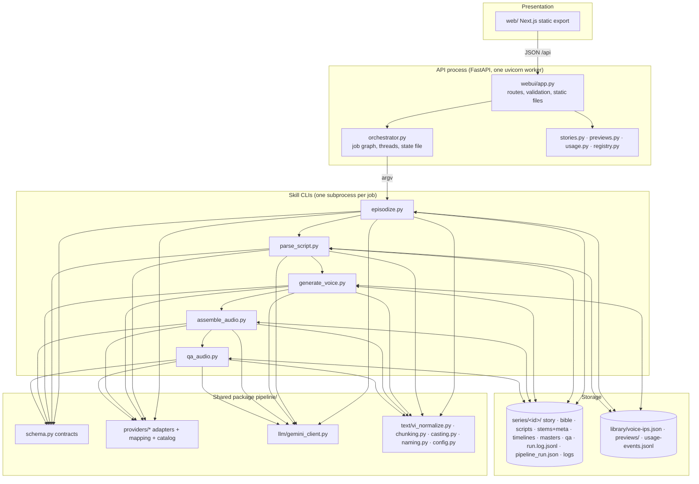
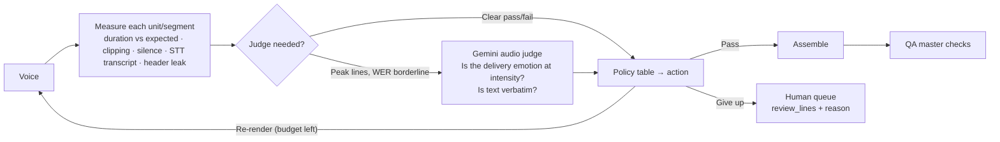
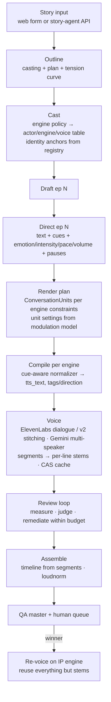

# Technical Specification: Audio AI Production Pipeline, next phase ("Director v2")

| | |
|---|---|
| Status | Proposal for review by the Lead AI System Architect |
| Date | 2026-09-22 |
| Scope | `README.md`, `docs/ARCHITECTURE.md`, `pipeline/`, `.claude/skills/`, `web/` as of today (74 tests passing, 1 skipped) |
| Audience | Engineers on the pipeline, the story-agent track and the voice-cloning track |
| Baseline data | two produced series on disk (`series/demo`, `series/hop-dong`), `run.log.jsonl`, vendor pricing checked 2026-09-21 |

---

## 0. Executive summary

The pipeline is a working, idempotent, file-contract system: story in, mastered episodes out, two TTS engines, a
web client, cost tracking and a locked Character IP registry. Every stage exists and is live-verified. What it
does **not** yet do is *perform*: lines are rendered without conversational memory on ElevenLabs, the emotion
system is a one-way table with no feedback, voice parameters are chosen per line without an identity anchor, and
QA is three real checks plus three stubs. The five challenges in the brief map onto exactly these gaps.

Verdict per challenge:

| # | Challenge | Implemented today | Gap | Recommended pattern |
|---|---|---|---|---|
| 1 | Dialogue context | Gemini: yes inside a scene chunk (multi-speaker, ≤2 actors). ElevenLabs: **no** (v3 rejects text context; v2 gets same-speaker context only) | No cross-chunk memory; no ElevenLabs conversational rendering | **Conversation Units** on both engines: ElevenLabs *Text to Dialogue* (v3, per-input timestamps) and Gemini multi-speaker, one manifest; request stitching for v2; context envelope stored, not hashed |
| 2 | Emotion delivery | Director emits emotion, intensity, pace, volume, ≤2 tags, free-text direction; compiled to v3 tags or a Gemini direction | Engine-specific tags leak into the contract; the normalizer destroys interruption/hesitation punctuation; no Vietnamese cue vocabulary; no series-level tension arc | **Delivery IR**: engine-neutral cues on each line, compiled per engine after a cue-aware normalizer; a per-series performance bible; a tension curve from the outline |
| 3 | Parameter modulation | Intensity → settings table (`mapping.py`) | Per-voice defaults silently disable modulation; `similarity_boost` is *lowered* at peaks (identity drift); v3 stability flips 0.5↔0.0 between adjacent lines; `speed` unused | **Anchor + envelope + delta** model per actor and engine, 2-D emotion (arousal/valence), smoothing and hysteresis, identity fixed, versioned mapping |
| 4 | Director agent | Linear: one LLM call per stage, QA is duration + loudness + stems, human verdict | No feedback loop, no self-correction, failed stems stop the episode | **Bounded supervisor loop**, not a free agent: deterministic measurements + LLM-as-judge (Gemini audio understanding, cents per day), remediation policy table, retry budget, human queue |
| 5 | Cost & quota | Hash cache, Gemini scene batching, previews rendered once, quota monitor, fail-fast on daily cap | No engine per role, no draft/final tier, no budget planner, ElevenLabs per-line requests | **Tiering** (engine per actor by role type; Gemini for retention tests, ElevenLabs for winners), a daily quota planner, content-addressed stem cache |

The single most valuable move is challenge 1 + 3 together: render dialogue as *conversation units* with an
identity-anchored parameter model. It improves naturalness on both engines, reduces ElevenLabs request count
by ~6x at the same credit cost, and gives the review loop (challenge 4) the per-segment timestamps it needs.

---

## 1. System audit and progress baseline

### 1.1 Method

Read every module under `pipeline/`, every skill script, the docs, the web API surface and the ElevenLabs SDK
(2.68) the adapter is built on; measured characters-per-second and words-per-second on the two series on disk;
ran the test suite. Findings cite files with line numbers where the behaviour lives.

### 1.2 Component status matrix

Status: **Full** = implemented, live-verified, tested. **Partial** = works but with a known limitation. **Stub** = interface only.

| Layer | Component | Status | Evidence / limitation |
|---|---|---|---|
| Contracts | `pipeline/schema.py` (StoryInput, SeriesOutline, EpisodeDraft, SeriesBible, EpisodeScript, VoiceRegistry, Timeline) | Full | Validators enforce ids, tags, sequential numbering, protagonist alias. Tags are ElevenLabs vocabulary hard-coded in the contract (`APPROVED_AUDIO_TAGS`). |
| Stage 0 | `episodize.py` outline (casting + episode plan) | Full | One call per series; pins enforced in code; one actor per role; placeholders queued. |
| Stage 0 | `episodize.py` draft | Full | Segment mode: verbatim check ≥ 0.7 with one retry at T=0.1. Write mode: two word-floor passes. No cross-episode memory beyond neighbouring loglines/cliffhangers. |
| Stage 1 | `parse_script.py` (AI Director) | Full | One call per episode; strict post-validation. Intensity "relative to the series" is prompt-only; the Director never sees previous episodes' delivery choices. Tag rules switch by engine. |
| Stage 2 | `registry.py`, `voice_registry.py` | Full | Lock rule in one place; changelog; per-engine voices; `default_settings` per voice exists but see 1.4 (d). |
| Stage 3 | `generate_voice.py`, `providers/elevenlabs.py` | Partial | Per-line, thread pool of 2, hash cache, 402 → placeholder voice, alignment stored. **No context on v3** (`NO_CONTEXT_MODELS`), same-speaker `previous_text/next_text` on v2 only, `previous_request_ids` unused, `speed` unused, Text-to-Dialogue unused. |
| Stage 3 | `providers/gemini_tts.py`, `chunking.py` | Partial | Scene batching (≤2 speakers per chunk) with a direction header; fail-fast on daily quota; single-speaker direction verified not spoken; **multi-speaker chunk verified by unit tests only** (quota exhausted at the time). |
| Stage 3 | `providers/mapping.py` | Partial | Intensity table; Gemini direction builder. Defects listed in 1.4 (d)–(f). |
| Stage 3 | `text/vi_normalize.py` | Partial | NFC, numbers, currency, time, dates, contractions, punctuation; tags protected. Em-dash → comma and ".." → "..." rewrite expressive punctuation (1.4 (g)). |
| Stage 5 | `assemble_audio.py` | Full | Measured durations, clamped Director pauses, scene gaps, two-pass loudnorm, manifest-aware. |
| Stage 6 | `qa_audio.py` | Partial | Real: stems complete, duration 60–150 % of target, loudness ±1 LU / TP. **Stubs**: clipping, silence, transcript diff. Human verdict recorded. |
| Orchestration | `orchestrator.py` | Full | Sequential job graph, subprocess per skill, state file after each transition, cancel, resume with `only`, cast job in-process. No retry policy per job; a failed job skips the rest of the episode. |
| API | `webui/app.py` | Full | 23 routes; runs are threads in the API process; `mark_interrupted_runs()` on startup. |
| Web | `web/` Next.js | Full | Library, story form, run board, characters, usage; previews once and cached. |
| Monitoring | `usage.py`, `usage-events.jsonl` | Full | Ledger aggregation, vendor 429/402 events, ElevenLabs subscription, reset countdowns. |
| Storage | local disk + sidecars | Full | Deterministic names via `naming.py`; no database. |
| Tests | `tests/` | Full | 74 passed, 1 skipped (live-data fixture). No live vendor calls. |

### 1.3 Separation of concerns



Responsibilities as they stand, and where they leak:

| Layer | Owns | Leaks / coupling to fix |
|---|---|---|
| FastAPI (`webui/app.py`) | HTTP contract, request validation, file serving, run registry in memory | Runs live in the API process (a restart kills them, mitigated by `mark_interrupted_runs`). 603 lines mixing routes with story-parsing helpers and preview logic; acceptable now, split when the review queue lands. |
| Orchestrator | Job graph, sequencing, state persistence, the cast job | The cast job is business logic inside the orchestrator (`ensure_voices`, 60 lines) rather than a skill; job summaries are parsed from the last JSON stdout line (fragile but consistent). |
| Skill CLIs | One stage each, argparse, exit codes, JSON summary | `generate_voice.py` carries planning (`plan_lines`, `plan_chunks`), rendering, fallback and manifest writing in one file; planning belongs in the package (see 3.2). |
| `pipeline/providers` | Vendor rules, request shapes, cost logging | `mapping.py` mixes two concerns: *what* the delivery is (engine-neutral) and *how* an engine expresses it (compiler). The contract in `schema.py` hard-codes ElevenLabs tag names. |
| Storage | Files with deterministic names, sidecar hashes | Cache is per-path, not content-addressed: the same line rendered in two series is rendered twice; a chunk's hash covers all its lines so any edit re-renders the whole chunk. |

### 1.4 Technical debt and bottlenecks (ranked)

a. **ElevenLabs v3 renders every line with zero context.** `providers/elevenlabs.py:26` (`NO_CONTEXT_MODELS`) is
   correct for the single-line endpoint, but the SDK exposes `text_to_dialogue.convert(...)` (v3, ≤ 2,000
   characters and ≤ 10 voices per request, `with_timestamps` returns `voice_segments` with start/end per input).
   This is the vendor's own mechanism for conversational cadence and is unused.

b. **Request stitching unused.** `previous_request_ids` (up to 3, v2-family models) conditions on the *audio*
   of prior generations at no character cost; the adapter only sends `previous_text/next_text`, and only when
   the neighbouring line is the same speaker (`generate_voice.py:plan_lines`).

c. **Multi-speaker Gemini chunk not live-verified.** `chunking.py` and the adapter are unit-tested; a real
   render must confirm that the numbered direction header is not spoken in multi-speaker mode.

d. **Per-voice defaults disable modulation.** `mapping.settings_for_line` starts from `pv.default_settings`
   and uses `setdefault`, so a voice that pins `stability` never gets intensity-driven changes. The registry's
   Gemini and ElevenLabs entries currently have no defaults, so nothing is broken today, but the semantics are
   inverted for what the voice-cloning track will need (an identity anchor that modulation moves *around*).

e. **Identity drift at peaks.** The v3 table lowers `similarity_boost` from 0.80 to 0.55 as intensity rises.
   Similarity is the identity knob; lowering it at the most memorable moments works against the IP strategy.

f. **Discrete stability flip-flop.** v3 stability is 0.5 for intensity ≤ 6 and 0.0 above; two adjacent lines at
   6 and 7 by the same actor get different timbre. No smoothing, no hysteresis. `PACE_SPEED` is defined and never
   applied; `speed` is supported by v2-family models.

g. **Normalizer rewrites expressive punctuation.** `vi_normalize.normalize_punctuation` turns "—" (interruption)
   into ", " and appends a terminal "." to every line, so a cut-off line ("Em không muốn—") becomes a completed
   statement. `[pause]` means a tag on v3 and a direction word on Gemini; neither produces a measured pause.

h. **QA stubs.** `check_clipping`, `check_silence`, `check_transcript_diff` return `ok: None`. Duration tolerance
   60–150 % is wide enough to pass an episode with a dropped line.

i. **No job-level retry or remediation.** A `ProviderError` on one line fails the voice job; the orchestrator
   skips assemble/qa and moves to the next episode. Humans re-run.

j. **Serial throughput.** Episodes are strictly sequential by design (D12). Per-episode wall time is dominated by
   LLM latency (draft + direct ≈ 40–60 s) and Gemini's 3 RPM on the free tier (chunks 20 s apart). At 30 episodes
   per day this is ~1 h of wall time on Gemini paid, ~2.5 h on free-tier RPM. Acceptable; not a target for
   parallelism.

k. **Cost blind spots.** Tags count as characters (~8 % of ElevenLabs spend); the monologue auto-tag adds 15
   characters per monologue line; drafts in write mode can cost up to 3 LLM calls. All small, all unmeasured
   per line.

l. **Two-series measurement only.** Baselines below come from 7.4 minutes of mastered audio. Treat them as
   order-of-magnitude until the first 30-minute day is produced.

### 1.5 Measured baseline

| Metric | demo (405 s, 6 eps) | hop-dong (41 s, 1 ep) |
|---|---|---|
| Words per second of master | 3.28 | 3.82 |
| TTS characters per second of master (incl. tags) | 15.4 | 17.5 |
| Characters per word | 4.69 | 4.58 |
| Lines per 60 s episode | 8–12 | 11 |
| Gemini scene chunks per episode (2-actor scenes) | 1–3 | 2 |

Derived: a 30-minute production day ≈ 32,000 TTS characters, ≈ 500 lines, ≈ 60–90 Gemini chunk requests or
≈ 500 ElevenLabs per-line requests (≈ 80–100 with Text to Dialogue).

---

## 2. Architectural analysis per challenge

Each section: current state, design options, comparison, the recommended pattern with its interface schema and
state model. Options are compared on latency (wall time per episode), operational cost (vendor $ and quota),
acoustic naturalness (expected listener-perceived quality), and engineering complexity (person-weeks and risk).

### 2.1 Dialogue context and cross-line synchronization

**Current state.** Gemini: a chunk is a run of ≤ 2 actors inside a scene; the model hears the whole exchange and
places reactive timing itself; a third actor or a pause line closes the chunk, so three-hander scenes fragment
into many small chunks and lose context at every cut. ElevenLabs: each line is an isolated request; v3 refuses
`previous_text`; the hash excludes context, so context changes never trigger a re-render (correct for cost,
invisible for quality).

**Options.**

| Option | Mechanism | Latency | Cost | Naturalness | Complexity |
|---|---|---|---|---|---|
| A. Text context envelope | Send `previous_text`/`next_text` for *any* speaker plus a one-line scene note; v2-family only | unchanged | free (context text is not billed as characters; verify on the Usage page after the first run) | small gain on v2, none on v3 | low (1 day) |
| B. Request stitching | `previous_request_ids` (≤ 3) chains generations on prior *audio*; v2-family only; needs request ids in sidecars and in-order rendering per scene | +10–20 % (scene becomes serial) | free | moderate gain on v2 | low–medium (2–3 days) |
| C. Conversation Units | Render a run of lines as one request: ElevenLabs **Text to Dialogue** (v3, ≤ 2,000 chars, ≤ 10 voices, `voice_segments` timestamps) and Gemini multi-speaker (≤ 2 voices). One planner, one manifest, per-line stems recovered by splitting on segment boundaries | −60–80 % requests per episode; wall time down | same characters; fewer requests (Gemini quota win) | **largest gain**: cadence, interruptions and reactive timing come from the model | medium (1–2 weeks incl. splitting, manifest v2, assembly and QA updates) |
| D. Director "reaction pass" | A second LLM pass rewrites `tts_text` with reactive cues ("(cắt lời)", breaths) using the previous line as context | +1 LLM call per episode (~$0.01) | negligible | moderate, engine-agnostic | low (2 days), but overlaps with 2.2 |
| E. Full-scene single voice per request with post-hoc diarization | One request per scene, split by speaker afterwards | low | low | poor: identity mixing risk | rejected |

**Recommendation: C as the default render mode on both engines, B as the v2 fallback path, A stored in the
sidecar for every unit.** D is folded into the Delivery IR work in 2.2 rather than a separate pass.

Design points:

1. **Unit planner is engine-aware, not engine-specific.** Replace `chunk_episode` with a `RenderPlanner` that
   receives per-engine constraints (`max_speakers`, `max_chars`, `supports_dialogue`) and produces
   `ConversationUnit`s. Gemini: ≤ 2 speakers. ElevenLabs v3: ≤ 10 speakers, ≤ 1,800 characters (margin under the
   2,000 documented limit), cut only at Director pauses ≥ 1,000 ms or scene ends. ElevenLabs v2: units of one line
   with stitching (B). Three-hander scenes on Gemini: choose split points that minimise unit count (a small
   dynamic-programming pass over the line sequence) instead of "close on third actor".

2. **Per-line stems are recovered, never lost.** Text to Dialogue returns `voice_segments` (start/end seconds,
   `dialogue_input_index`); Gemini has no segments, so the planner keeps the chunk stem and the manifest maps
   lines to it as today. Where segments exist, `generate_voice` cuts per-line WAVs (with 40 ms guard bands) so the
   review loop (2.4), alignment storage and single-line pickups keep working.

3. **Cache policy.** `unit_hash` = hash of (engine, model, ordered voice ids, ordered final texts, unit-level
   settings, mapping version). A changed line re-renders its unit. For ElevenLabs a "pickup" mode re-renders one
   line in isolation and splices it in at the segment boundary, flagged `pickup: true` in the manifest so QA
   listens to the join. Context envelope (previous unit id, request ids) is recorded in the sidecar, excluded
   from the hash.

4. **Unit-level settings on ElevenLabs.** Text to Dialogue accepts one `settings` object per request (stability
   and an open model), so per-line stability modulation is not possible inside a unit. Modulation moves to unit
   level (max intensity in the unit) and per-line expression is carried by cues and punctuation (2.2). This is the
   real trade-off of option C and the reason line mode stays available for peak lines (a Director-marked
   intensity ≥ 9 line may be rendered alone with its own settings and stitched via segment boundaries).

**Interface schema (manifest v2, `stems/epNN/render.json`).**

```json
{
  "version": 2,
  "engine": "elevenlabs",
  "model_id": "eleven_v3",
  "mode": "conversation",
  "units": [
    {
      "id": "ep01_sc01_u01",
      "kind": "conversation",
      "path": "ep01_sc01_u01_unit.wav",
      "scene_id": "sc01",
      "line_ids": ["ep01_sc01_l001", "ep01_sc01_l002", "ep01_sc01_l003"],
      "actors": ["ngan", "duong"],
      "settings": {"stability": 0.5, "mapping_version": 2},
      "segments": [
        {"line_id": "ep01_sc01_l001", "start_ms": 0, "end_ms": 2870, "path": "ep01_sc01_l001_ngan_dialogue.wav"},
        {"line_id": "ep01_sc01_l002", "start_ms": 3010, "end_ms": 5400, "path": "ep01_sc01_l002_duong_dialogue.wav"}
      ],
      "context": {"previous_unit": null, "request_ids": ["..."]},
      "pause_after_ms": 500,
      "hash": "sha256:..."
    }
  ]
}
```

Assembly places one clip per unit (as today for chunks) or per segment when a pickup replaced a segment; QA
reads segments for per-line checks.

### 2.2 Emotion delivery and Vietnamese acoustic cues

**Current state.** The Director's output is already rich (emotion enum, intensity 1–10, pace, volume, ≤ 2
approved tags, free-text `acoustic_direction`, `pause_after_ms`). The weaknesses are in the *encoding*:
`tts_text` carries ElevenLabs tag names as the neutral representation; Gemini gets those tags translated
(`TAG_VI`) into a direction sentence; the normalizer runs on `tts_text` and rewrites punctuation that the engines
use as prosodic cues; the Director has no memory of previous episodes so "9–10 only for two peaks" drifts across
30 episodes.

**Options.**

| Option | Mechanism | Cost | Naturalness | Complexity |
|---|---|---|---|---|
| A. Prompt-only | Richer Director prompt: cue examples, Vietnamese particle guidance, engine rules | none | small, brittle across engines | very low |
| B. Delivery IR | Engine-neutral `cues[]` on each line, compiled to v3 tags + punctuation, Gemini direction + punctuation, or a future clone engine's own controls; normalizer becomes cue-aware | none | high, and durable across engine changes (cloning track) | medium (1 week) |
| C. Performance bible | One LLM call per series produces 3–5 exemplar lines per emotion in the series' tone; injected into every Director call as few-shot | +1 call per series | medium, consistency gain | low (2 days) |
| D. Tension curve | Outline returns a `tension` (1–10) target per episode; the Director receives it plus the previous episode's peak lines and reserves 9–10 accordingly | none (fields on existing calls) | medium (cross-episode consistency) | low |
| E. SSML / phoneme control | Not offered by v3 or Gemini TTS for Vietnamese | n/a | n/a | rejected |

**Recommendation: B + C + D.** A is subsumed by B's compiler prompts.

**Delivery IR.** A closed vocabulary that the Director may use, validated by the schema, independent of engine:

```
cue            meaning                              v3 compiler            Gemini compiler (direction + text)
breath         audible inhale before the line       [exhales] / [gasps]    "hít một hơi trước khi nói"
sigh           sigh before the line                 [sighs]                "thở dài trước khi nói"
laugh, chuckle laughter within or before            [laughs] / [chuckles]  "bật cười" / "cười khẽ"
whisper        whispered delivery                   [whispers]             "thì thầm"
cry, sob       crying voice                         [crying] / [sobbing]   "vừa khóc vừa nói"
hesitate       false start / stall                  [hesitates] + "…"      "ngập ngừng" + "…"
trail_off      sentence fades, unfinished           text ends with "…"     "bỏ lửng câu" + "…"
interrupt      cut off mid-word by the next line    text ends with "—"     "bị cắt lời giữa chừng" + "—"
beat:<ms>      measured silence inside the line     [pause] (v3 only)      split the line at the beat (planner)
emph:<word>    stress a word                        UPPERCASE word         "nhấn mạnh chữ «word»"
inner          first-person inner voice             [internal monologue]   "độc thoại nội tâm, mic gần"
shout          projected                            [shouting]             "hét lên"
```

Rules that make it Vietnamese-safe:

1. **Normalize first, cue last.** Pipeline per line: NFC → numbers/currency/dates → contractions → *then* cue
   compilation adds tags and terminal punctuation. The normalizer's punctuation pass is split into "repair"
   (whitespace, quotes, markdown residue) which always runs, and "terminal punctuation" which the compiler owns
   (it must not append "." after "—" or "…").
2. **Diacritics are never touched** by any compiler; emphasis uses uppercase only on v3 (verified safe for
   Vietnamese uppercase with diacritics? this needs a 10-line probe; if not, emphasis compiles to a direction).
3. **Particles are content, not cues.** "ơi", "à", "hử", "ừm", "nhé" stay in `text`; the Director is told they
   are the natural Vietnamese way to carry attitude and should be preferred over tags.
4. **Numbers as words in the Director, normalizer as safety net** (already the case); log a warning when the
   normalizer changes a line the Director produced, so prompt regressions are visible.
5. **`beat:<ms>` becomes a planner instruction**, not a tag: the unit planner splits the line and the timeline
   inserts the exact silence. That is how "measured pause inside a line" works identically on both engines.
6. **Engine probes are tests.** A small live-probe script (run manually, cost < 200 characters) renders one line
   per cue per engine and stores the WAV under `library/probes/`; the team listens once and records "works /
   spoken aloud / ignored" in a table checked into the repo. The compiler consults that table (a cue marked
   "spoken aloud" on an engine is compiled to punctuation only).

**Schema change.** `Line.cues: list[str]` (validated against the vocabulary), `Line.tts_text` becomes
*derived* (compiled) rather than authored: the Director writes `text` + `cues` + the existing fields; the
compiler writes `tts_text` per engine at render time and stores it in the sidecar. This removes the
`TAG_RULES_ELEVENLABS/GEMINI` branching from the Director prompt and makes engine choice a render-time decision
(needed for 2.5 role tiering).

**Tension curve (D).** `EpisodePlan.tension: int` (1–10) from the outline; the Director prompt receives
"tension target for this episode: 8; previous episode's peaks: [...]" and the rule "9–10 only if tension ≥ 8".
The performance bible (C) is `series/<id>/performance.json` (see 2.3 for the same file's actor section).

### 2.3 Dynamic TTS parameter modulation

**Current state.** `mapping.settings_for_line` is a step function of intensity only. Identity (similarity) is
modulated in the wrong direction, per-voice defaults override modulation entirely, v3's discrete stability has
no hysteresis, `speed` is unused, and monologue handling is a fixed offset. Nothing is per actor; every voice
gets the same curve regardless of how much range that voice tolerates before it stops sounding like itself.

**Options.**

| Option | Mechanism | Cost | Naturalness / identity | Complexity |
|---|---|---|---|---|
| A. Tuned global table | Fix the defects, keep one curve | none | better, still one-size | very low |
| B. Anchor + envelope + delta | Per actor and engine: an identity anchor (the settings the preview was approved at), an envelope (allowed range per knob), a delta function of emotion class, intensity and line type, clamped to the envelope, smoothed across consecutive lines | none | identity preserved by construction; expressiveness bounded per voice | medium (3–4 days + calibration tool) |
| C. Learned mapping | Fit settings from listener ratings | data collection | unknown | high; premature |
| D. LLM picks numeric settings per line | Director outputs stability etc. | none | unstable, engine-specific, defeats the lock | rejected |

**Recommendation: B**, with A's fixes as its first step.

**Model.**

```
VoiceIdentity (per actor, per engine, stored in library/voice-ips.json under providers[engine].identity)
  anchor:    {stability: 0.5, similarity_boost: 0.80, style: 0.15, speed: 1.0}       # approved preview settings
  envelope:  {stability: [0.3, 0.8], style: [0.0, 0.5], speed: [0.85, 1.15]}          # what still sounds like this actor
  fixed:     ["similarity_boost"]                                                     # never modulated
  discrete:  {stability: [0.0, 0.5, 1.0]}                                            # v3 only

Delta (engine-neutral, pipeline/providers/modulation.py)
  arousal(emotion, intensity) ∈ [0,1]:   angry/fearful/desperate/surprised/excited → high; sad/tender/neutral → low
  valence(emotion) ∈ [-1,1]
  stability_delta = -0.35 * arousal                     (more creative when aroused)
  style_delta     = +0.40 * arousal + (0.10 if monologue)
  speed_delta     = +0.12 * arousal - 0.10 * (1 - arousal) * is_slow_pace + pace_term
  monologue: stability +0.05, speed −0.05, volume floor "soft"
  smoothing: exponential moving average (α = 0.5) over consecutive lines of the same actor within a scene
  hysteresis (v3 discrete): switch 0.5 → 0.0 only when arousal ≥ 0.65, back only when ≤ 0.45
  clamp to envelope; similarity_boost = anchor (never lowered)
Gemini: the same arousal/valence feed the direction adjectives (intensity words) so both engines share one model.
```

**Why per actor.** The voice-cloning track will produce voices whose usable range differs (a cloned calm
narrator may break up at stability 0.2; a trained expressive voice may not). The envelope is the artefact that
track delivers per voice, found with a **range-test tool**: render the same four probe lines at four settings
(≈ 300 characters per voice per engine, once), the owner listens, records the envelope in the registry. The
registry lock covers the identity block, so it is versioned in the changelog like the voice id.

**Versioning.** `mapping_version` is part of the request settings and therefore of the hash. Changing the
delta function is an explicit decision that re-renders (and re-spends) only when the team bumps the version.

**Unit-level settings (ElevenLabs conversation units).** The unit's stability is computed from the unit's
maximum arousal; lines whose own target differs from the unit setting by more than 0.25 are candidates for
line-mode pickups (2.1, point 4). The planner records the decision in the manifest so it is auditable.

### 2.4 Evolution to an autonomous AI Director agent

**Current state.** Deterministic stages, one LLM call each, strict schema validation, no measurement of the
audio beyond loudness and duration, no automatic remediation. The strengths of this design are the ones the
business needs: reproducibility (a retention A/B needs identical inputs), idempotent re-runs, auditable cost,
and stages a human can re-run by hand.

**Options.**

| Option | What changes | Latency | Cost | Quality | Complexity / risk |
|---|---|---|---|---|---|
| A. Linear + deterministic remediation | Real QA checks; fixed retry rules (retry, alternate model, placeholder); no LLM in the loop | +5–10 % | +1–3 % re-renders | catches broken stems, not bad acting | low |
| B. Bounded supervisor loop with LLM-as-judge | A `review` stage after voice: deterministic measurements + Gemini audio-understanding judgments on selected lines; remediation policy table; retry budget per unit and per episode; human queue for what remains | +15–30 % | +$0.02/day judge tokens, +5–10 % re-renders | catches broken *and* mis-acted lines; explainable decisions | medium |
| C. Autonomous tool-using Director agent | An agent plans, renders, listens, rewrites script and settings until satisfied | unbounded | unbounded | potentially highest, unmeasurable | high: nondeterministic, breaks file contracts and cost caps, hard to debug, undermines A/B validity |

**Recommendation: B.** Keep the pipeline linear and deterministic; add one closed loop with a fixed budget and a
policy table; use the LLM only as a *judge* on bounded questions, never as a planner. C is not appropriate for a
retention-testing funnel whose value depends on comparable outputs.

**Review stage design.**



Measurements (all deterministic, FFmpeg-based or a cheap LLM call):

| Check | Method | Threshold | Cost |
|---|---|---|---|
| Duration plausibility | segment seconds vs words / 3.6 w/s | outside 0.6–1.6× → suspect | none |
| Clipping | `astats` peak per stem | > −0.1 dBFS | none |
| Long silence | `silencedetect` n=−50 dB d=1.5 s inside a stem | any | none |
| Leading/trailing silence | `silenceremove` measurement | > 700 ms → trim (deterministic fix, no re-render) | none |
| Transcript | Gemini `gemini-3.1-flash-lite` audio input, ask for verbatim Vietnamese transcript | WER > 15 % vs `text` → fail; 8–15 % → judge | ≈ 32 tokens/s of audio ≈ $0.02 per 30-minute day |
| Direction leak (Gemini batching) | transcript contains header words ("Nhân vật", "Chỉ dẫn", speaker labels) | any → re-render in line mode | included above |
| Delivery judgment | same model, audio + "rate emotion match 1–5 and name what is wrong"; only for lines with intensity ≥ 8 or monologues ≥ 7 | < 3 → one re-render with adjusted cue/direction, then human | ≈ 40 lines/day ≈ $0.01 |
| Identity drift (optional, later) | speaker-embedding cosine similarity between the stem and the actor's approved preview (local model, no vendor) | < 0.75 → flag | CPU only |

Remediation policy (first match wins; every action and its cost logged to `qa/epNN_review.json`):

| Finding | Action 1 | Action 2 | Then |
|---|---|---|---|
| Provider error, retryable | retry with backoff (exists) | same voice, fallback model (v3 → v2 with stitching; Gemini 3.1 → 2.5) | placeholder voice, flagged |
| Direction leak | re-render unit in line mode | | human |
| Silence / clipping | trim or re-render with a new `seed` | | human |
| Duration off | re-render with `seed`+1 | re-render with intensity −2 | human |
| WER fail | re-render with `seed`+1 | re-render with cues removed | human, with transcript diff |
| Delivery judged < 3 | re-render with the judge's note appended to the direction / cue changed | | human |

Budgets: ≤ 2 re-renders per unit, ≤ 6 per episode, ≤ 10 % of the episode's characters; exceeding a budget stops
remediation and queues the episode. Budgets live in `config.py` and are shown on the Usage page.

**State model.** `qa/epNN_review.json`:

```json
{"episode": 1, "attempts": [{"unit": "ep01_sc01_u01", "finding": "wer", "value": 0.22, "action": "rerender_seed",
  "cost": {"characters": 412}, "result": "pass", "at": "..."}],
 "queue": [{"line_id": "ep01_sc02_l004", "reason": "delivery 2/5: sounds calm, expected desperate 9", "audio": "..."}],
 "budget": {"rerenders": 3, "max": 6, "characters": 900, "max_characters": 1800}}
```

**Where it lives.** A new skill `review-audio` (CLI, same conventions) performs measurement and judgment and
prints the actions; the orchestrator executes actions by re-invoking `generate-voice --lines ... --seed ...` and
loops until pass or budget. The run board gets a `review` chip and a human queue view; the existing human verdict
stays the publish gate.

### 2.5 Cost efficiency and provider quota optimisation

**Current state (already good).** Hash cache per stem; Gemini scene batching (1–3 requests per episode);
previews rendered once per engine and voice; fail-fast on the daily cap with a clear message; the Usage page with
resets; `--dry-run` character counts; sequential runs. Missing: engine choice per *actor*, a production tier
concept, a quota planner, request-count reduction on ElevenLabs, and cross-series reuse.

**Pricing reference (checked 2026-09-21) for one 30-minute day ≈ 32k characters, 15 h/month.**

| Engine | Unit price | Per day | Per month | Plan that fits |
|---|---|---|---|---|
| Gemini 2.5 Flash TTS (paid) | $10/M audio tokens (25 tok/s), $0.50/M text | $0.50 | $15 | billing enabled, pay as you go |
| Gemini 3.1 Flash TTS (paid) | $20/M audio, $1/M text | $0.95 | $28 | same |
| ElevenLabs v3 / multilingual v2 | $0.10 per 1k characters | $3.20 | $100 | Pro ($99, API pricing page lists 990k characters; the plans page lists 600k credits, confirm at checkout) |
| ElevenLabs Flash v2.5 | $0.05 per 1k characters | $1.60 | $50 | Creator/Pro; supports Vietnamese (multilingual v2 does **not** list Vietnamese, so it is the wrong same-voice fallback) |
| Gemini free tier | 10 requests/day/model | covers 3–10 batched episodes/day, not 30 | | |

**Options.**

| Option | Mechanism | Saving | Quality | Complexity |
|---|---|---|---|---|
| A. Production tiers | Retention test episodes on Gemini (paid); only winning series re-voiced on ElevenLabs. Scripts, Director output and timelines are reused; only the voice stage re-runs | ~70–85 % of TTS spend while testing | test audio is Gemini quality; winners get IP voices | low: `--tts` already a run parameter; add a "re-voice" command that keeps everything but stems |
| B. Role tiering (engine per actor) | `role_type` → engine policy: protagonist/antagonist on ElevenLabs IP voices, supporting/minor on Gemini or Flash v2.5 | 30–50 % of ElevenLabs characters | mixed timbre inside a scene; loudnorm equalises level, not texture; acceptable for minor roles | medium: units are single-engine, so mixed scenes fall back to line mode for the minority engine |
| C. Quota planner | Daily plan from limits: episodes/day per engine, model pooling on Gemini free tier (10 + 10 across the two Flash TTS models), start times, and a "will not fit" warning before spending | avoids wasted partial days | none | low–medium |
| D. Request diet on ElevenLabs | Conversation units (2.1): ~6× fewer requests, same characters; matters for concurrency limits and latency, not credits | 0 credits, −80 % requests | up | included in 2.1 |
| E. Character diet | ≤ 1 tag per line unless a peak; no auto-monologue tag when a cue exists; strip trailing tags on v2/Flash (compiler) | 5–8 % of characters | neutral | trivial |
| F. Content-addressed stem cache | `library/cache/<hash>.wav` shared across series and re-runs; per-episode paths become links | 100 % on any repeated line (recaps, catchphrases, re-runs after a series edit) | none | low |
| G. Cheaper LLM path | Keep `gemini-3.1-flash-lite`; write mode's expansion passes capped at 1 when tension ≤ 5 | negligible ($5/month total) | n/a | skip |

**Recommendation: A + C + D + E + F now; B as a policy switch once conversation units exist.** A is the
business model itself (audio is the cheap funnel), so the pipeline should make "re-voice the winner" a
one-click operation in the Library.

**Engine policy schema (RunParams and `series.json`).**

```json
"engine_policy": {
  "default": {"provider": "gemini", "model": "gemini-3.1-flash-tts-preview"},
  "by_role_type": {"protagonist": {"provider": "elevenlabs", "model": "eleven_v3"},
                   "antagonist": {"provider": "elevenlabs", "model": "eleven_v3"}},
  "by_actor": {"ngan": {"provider": "elevenlabs", "model": "eleven_v3"}},
  "tier": "test"            // test | final ; "final" forbids placeholder voices
}
```

Precedence: by_actor > by_role_type > default. The cast job resolves the policy into a concrete
(actor → engine, model, voice) table written to the bible, which the planner, compiler and modulation read.

**Quota planner (`pipeline/budget.py`).** Inputs: engine policy, limits from `usage.py`, the episode plan
(lines and actors per episode from the drafts if present, else averages). Output: a `plan.json` with the
number of episodes that fit today per engine, the request and character estimate, and the earliest time the
rest can run. Surfaces in the run form before "Start" and blocks a run that cannot finish one episode.

---

## 3. Recommended end-to-end architecture

### 3.1 Flow



Storage stays local files with sidecars (D7). It fits the workload (tens of MB per series, one writer) and the
review loop only adds one JSON per episode. A database is warranted only when hosting moves off one machine (see
the hosting note in `web/README.md`); the file contracts make that migration a storage-adapter change, not a
redesign.

### 3.2 Modules to add or change

| Module | Change | Replaces / touches |
|---|---|---|
| `pipeline/delivery.py` (new) | Cue vocabulary, validation, per-engine compilers, probe table | `mapping.gemini_style`, `text_for_provider`, `TAG_RULES_*` in the Director prompt |
| `pipeline/providers/modulation.py` (new) | VoiceIdentity, arousal/valence delta, smoothing, hysteresis, `mapping_version` | `mapping.settings_for_line` (kept as a thin wrapper for one release) |
| `pipeline/render_plan.py` (new) | `RenderPlanner`, `ConversationUnit`, manifest v2 read/write, segment splitting | `chunking.py` (generalised), planning code inside `generate_voice.py` |
| `pipeline/providers/elevenlabs.py` | `synthesize_dialogue(inputs, settings, seed)`; `previous_request_ids`; `speed`; request id capture | adapter |
| `pipeline/providers/gemini_tts.py` | unchanged interface; header built by the compiler; `seed` plumbed if supported | adapter |
| `pipeline/text/vi_normalize.py` | split into `repair` and `terminal` passes; protect "—" and "…"; change log per line | normalizer |
| `pipeline/schema.py` | `Line.cues`, `EpisodePlan.tension`, `VoiceIdentity`, `EnginePolicy`, manifest v2 model, review report model | contracts |
| `.claude/skills/review-audio/` (new) | Measurements, judge calls, action list | new stage |
| `pipeline/orchestrator.py` | `review` stage with remediation loop and budgets; engine policy; re-voice run kind | orchestrator |
| `pipeline/budget.py` (new) | Quota planner | new |
| `pipeline/cache.py` (new) | Content-addressed stem store | `is_cached` in `generate_voice.py` |
| `webui/app.py`, `web/` | review queue, budget preview, engine policy UI, re-voice button, identity range-test UI | client |

### 3.3 Contracts that change

- `EpisodeScript` 1.1: `cues` on lines; `tts_text` optional in the Director output and always present in the
  sidecar. Schema version bump; old parsed files remain valid (compiler treats tags in `tts_text` as cues).
- `SeriesBible`: `tension` per episode, `engine_table` from the cast job, `tier`.
- `VoiceRegistry`: `identity` per provider voice, covered by the lock.
- `render.json` v2, `qa/epNN_review.json` new.

---

## 4. Phased roadmap

Priorities follow value per effort and dependency order. Weeks are one engineer; the two tracks in section 5 run
in parallel. Every phase ends with a listening test on the same 3-episode fixture series and a cost report from
the ledger, so quality and spend are compared against the previous phase, not against opinion.

| Phase | Weeks | Deliverables | Exit criteria |
|---|---|---|---|
| **1. Delivery foundations** | 1–2 | `delivery.py` cue vocabulary + compilers; cue-aware normalizer; probe script and probe table for both engines; `modulation.py` with VoiceIdentity anchor/envelope/delta, hysteresis, `speed`, `mapping_version`; defaults-override fix; range-test CLI; tension curve in the outline and Director prompt | Probe table checked in; blind A/B on the fixture (old vs new mapping) preferred ≥ 60 %; no identity regressions (similarity never lowered); tests for compiler and modulation |
| **2. Conversation units** | 2–4 | `render_plan.py`; ElevenLabs Text-to-Dialogue adapter with segment splitting and request-id capture; v2 stitching; Gemini multi-speaker live-verified; manifest v2 consumed by assembly and QA; pickup mode; CAS cache | ElevenLabs requests per episode ≤ 3 at unchanged characters; per-line stems present for every line; one-line edit re-renders one unit or one pickup; listening test shows improved cadence |
| **3. Closed-loop review** | 4–6 | `review-audio` skill: clipping, silence, trim, transcript WER via Gemini audio, header-leak detection, delivery judge for peaks; policy table and budgets in the orchestrator; review queue in the web client | Auto-pass rate reported per episode; human review time per episode measured and down; judge cost ≤ $0.05/day; no unbounded loops (budget tests) |
| **4. Cost tiering and planning** | 6–8 | Engine policy (default / by role type / by actor); "re-voice winner" run kind; quota planner with pre-run preview; character diet in the compiler | A test series produced on Gemini and re-voiced on ElevenLabs without touching scripts; planner predictions within 15 % of the ledger |
| **5. Platform hardening** | 8–10 | Split the API from the run worker (a worker process with a file-backed queue), hosting per `web/README.md`, optional Postgres index for the library only | Runs survive API restarts without `mark_interrupted_runs`; one hosted deployment used by the team |

Refactor first: (1.4 d–g) in phase 1, `generate_voice.py` planning extraction in phase 2, orchestrator review
loop in phase 3. Introduce new subsystems only after the contracts they depend on exist (cues before compilers,
manifest v2 before review, engine table before tiering).

---

## 5. Integration points for the two parallel tracks

**Story research agent (trending genres → script).** Its output contract is `StoryInput` exactly as the web form
produces it: overview (title, genre, setting, total minutes), roles with optional pinned actors, script. It
should call `POST /api/runs` (or write `series/<id>/story.json` and call the orchestrator CLI) and never write
bibles or drafts directly, so the outline's casting and tension logic stay the single source. Two additions
make the agent more useful: a `tier: "test"` default so its series always go to the cheap engine, and the
tension curve field, which the agent may propose and the outline may override.

**Voice cloning (own recordings → Character IP voices).** The registry already models per-engine voices; the
work lands in three places: (1) a new `providers[engine]` entry per actor with the cloned `voice_id` (ElevenLabs
PVC needs Creator or above; MiniMax rapid cloning is $1.50 per voice if that engine returns), or a self-hosted
adapter implementing `TtsProvider` for an open Vietnamese-capable model, which the adapter pattern already
allows; (2) the **VoiceIdentity envelope** per cloned voice from the range-test tool, which is the deliverable
that makes modulation safe; (3) the identity-drift check in the review loop using the approved preview as the
reference. Because cues are engine-neutral (2.2), a cloned-voice engine needs only a compiler entry, not a
Director change.

---

## 6. Risks and open questions

1. **Text to Dialogue behaviour with Vietnamese and tags** is documented but not yet probed on this account;
   phase 2 starts with a 500-character probe. Fallback if it under-performs: per-line v3 with unit-level
   settings and the review loop, which still delivers 2.3 and 2.4.
2. **Gemini multi-speaker direction leak** is the main quality risk of scene batching; the review loop's
   leak detector is the mitigation, and line mode remains one flag away.
3. **Preview-status models.** Both Gemini TTS models are previews; the catalog already isolates model ids, and
   the probe table must be re-run when a model changes.
4. **Judge reliability.** An LLM rating "does this sound desperate" is noisy; it is used only to *select* lines
   for human review and to allow one re-render, never to approve publication.
5. **Vendor plan ambiguity** (ElevenLabs credits vs characters on two pricing pages) affects the planner's
   ElevenLabs numbers; read the subscription endpoint (already implemented) as the source of truth.
6. **Retention comparability.** Any change to mapping, cues or units changes the audio; the `mapping_version`
   and manifest version are recorded per stem so an A/B can be attributed.

---

## 7. Decisions requested

1. Adopt **conversation units on both engines** (2.1 option C) as the default render mode, keeping line mode for
   pickups and peaks.
2. Adopt the **Delivery IR** (2.2 option B) and make `tts_text` a compiled artefact; approve the cue vocabulary
   as the contract the Director and the cloning track both target.
3. Adopt the **anchor + envelope + delta** modulation model (2.3 option B) with `similarity_boost` fixed and the
   envelope stored in the locked registry.
4. Adopt the **bounded supervisor loop** (2.4 option B) with the budgets in 2.4, and reject a free-running
   Director agent for this product.
5. Adopt **production tiers** (test on Gemini paid, re-voice winners on ElevenLabs Pro) as the standing cost
   policy, with role tiering as a later switch.
6. Approve the phase order in section 4 and the two integration contracts in section 5.
