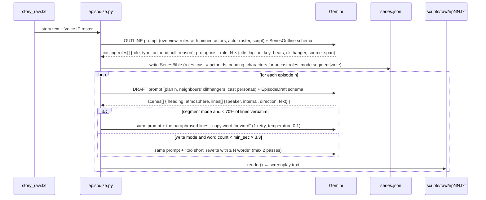
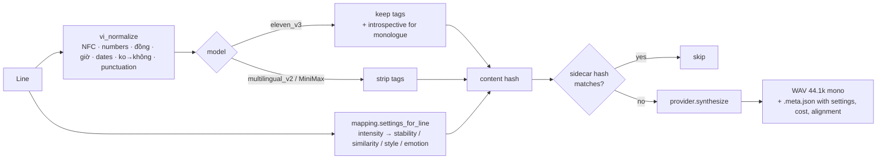
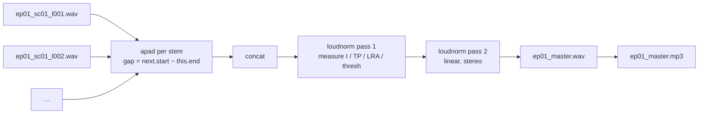
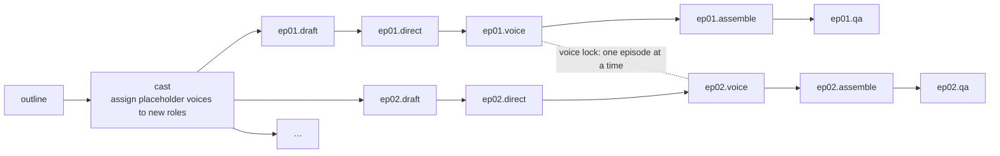
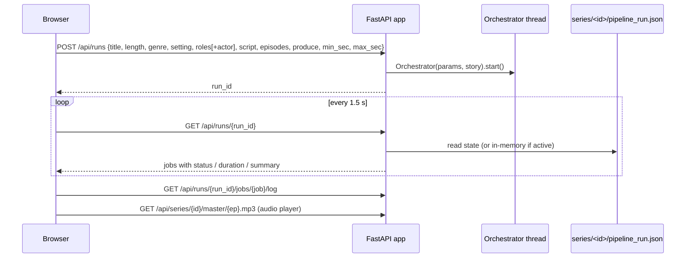

# Architecture walkthrough

How one pasted story becomes a set of mastered Vietnamese audio episodes, step by step. Diagrams are
Mermaid and render in GitHub, VS Code and most Markdown viewers.

Audience: engineers and the director/producer who will operate the pipeline. Assumes you have read
the decision table in `CLAUDE.md`.

---

## 1. The system in one picture

```mermaid
flowchart LR
    subgraph Input
        ST[story.json<br/>overview · roles (+ /actor tags) · script]
        REG[(library/voice-ips.json<br/>locked Voice IP registry of actors)]
    end

    subgraph "Stage 0 · episodize (Gemini)"
        OUT[Outline call: casting + episode plan<br/>→ series.json]
        DR[Draft call ×N<br/>segment: copy lines verbatim · write: expand<br/>→ scripts/raw/epNN.txt]
    end

    subgraph "Stage 1 · parse-script (Gemini)"
        DIR[AI Director<br/>→ scripts/parsed/epNN.json]
    end

    subgraph "Stage 3 · generate-voice (ElevenLabs)"
        NORM[vi_normalize]
        MAP[intensity → settings]
        TTS[TTS per line<br/>→ stems/epNN/*.wav + .meta.json]
    end

    subgraph "Stage 5 · assemble-audio (FFmpeg)"
        TL[timeline from measured durations<br/>→ timelines/epNN_timeline.json]
        MIX[concat + two-pass loudnorm<br/>→ masters/epNN_master.wav/mp3]
    end

    subgraph "Stage 6 · qa-audio"
        QA[auto checks + human verdict<br/>→ qa/epNN_report.json]
    end

    ST --> OUT --> DR --> DIR --> NORM --> MAP --> TTS --> TL --> MIX --> QA
    REG --> OUT
    REG --> MAP
    ORCH[[pipeline/orchestrator.py<br/>runs the CLIs as jobs]] -.drives.-> OUT & DR & DIR & TTS & TL & QA
    WEB[[pipeline/webui<br/>browser client]] -.starts / watches.-> ORCH
```

Every arrow is a file on disk with a deterministic name (see `pipeline/naming.py`). That is the
central design choice: any stage can be re-run alone, the pipeline is idempotent, and a human can
inspect or hand-edit any intermediate artifact.

## 2. Repository map

```
pipeline/                 shared Python package
  schema.py               Pydantic contracts for every file that crosses a stage boundary
  naming.py               the only place paths and stem names are built
  config.py               .env-backed settings (models, padding, loudness, flags)
  llm/gemini_client.py    generate_structured(system, user, schema) → (instance, usage)
  providers/              TTS adapters: base.py, elevenlabs.py, minimax.py, mapping.py
  text/vi_normalize.py    Vietnamese text normalizer for TTS
  orchestrator.py         job graph runner (CLI: python -m pipeline.orchestrator)
  webui/                  FastAPI app + single HTML page (python -m pipeline.webui)
.claude/skills/<name>/    one skill per stage: SKILL.md (how to use) + scripts/<name>.py (CLI)
library/voice-ips.json    global, locked Voice IP registry
series/<id>/              everything about one series (inputs, intermediates, outputs, logs, run state)
tests/                    pytest, no network; fixtures under tests/fixtures/
```

Skills are thin CLIs: they parse arguments, resolve paths through `naming`, and call into
`pipeline/`. They never call a vendor SDK directly. This is what lets the orchestrator and the web
UI run exactly the same code a developer runs by hand.

## 3. Stage by stage

### Stage 0 · episodize (sectioned story → casting + series bible + raw scripts)

Skill: `.claude/skills/episodize`. The director fills three sections in the web form, saved as
`series/<id>/story.json` (`StoryInput`):

| section | fields | used for |
|---|---|---|
| Overview | name, expected length, genre, setting | tone and episode count suggestion (length ÷ episode length) |
| Characters | one row per story **role**: name, description, optional **actor** (dropdown or `/ngan` tag) | casting |
| Script | the whole story, scene by scene | segmentation into episodes |

Vocabulary: a **role** is a character in the story ("Tô Mạn"); an **actor** is a Voice IP in the
registry ("ngan"). The outline call casts roles onto actors (user tags are pinned; the model picks
the rest by gender, age, personality and voice description; one actor per role; roles nothing fits
get a slug id and a placeholder voice). Stems and `character_id` always carry the actor id, and
each Director line also records `role_name`.

Two kinds of Gemini calls, both through `generate_structured` with a Pydantic `response_schema`.



Why structured drafts: the model's free-text screenplay lost line breaks and mislabeled
monologues. With `EpisodeDraft` the model only fills fields (speaker = role name); `render()` writes
the exact format the Director parses:

```
TẬP 01 - Cuộc gọi lúc nửa đêm

CẢNH 1. Văn phòng kiến trúc nhỏ của Linh. Hai giờ sáng.
(Tiếng mưa rơi lộp độp trên mái tôn.)
LINH (nội tâm): Ba năm rồi. …
MINH-KHOI (giọng trầm, qua điện thoại): Linh. Là anh đây.
```

Mode: `segment` when the pasted script is long enough to fill the episodes (it is cut at the
tensest points and lines are copied verbatim, verified by a normalized substring check), `write`
when the input is a treatment (dialogue is written from the plan).

Length control: measured speaking pace on ElevenLabs v3 is about 3.6 words/s, so the draft target
is `min_sec × 3.3` words with two expansion passes if the model under-writes.

### Stage 1 · parse-script, the AI Director (raw script → EpisodeScript JSON)

Skill: `.claude/skills/parse-script`. One Gemini call per episode with the `EpisodeScript` schema.
The Director adds what a voice engine needs and a writer does not write:

| field | meaning | consumer |
|---|---|---|
| `type` | `dialogue` / `monologue` / `pause` | naming, settings |
| `character_id` | actor id (from the casting table), or alias `protagonist` for inner voice (rewritten on save) | registry lookup |
| `role_name` | the story role the line belongs to | humans, web UI |
| `text` | the writer's line verbatim | subtitles, QA transcript diff |
| `tts_text` | same line prepared for the engine: approved `[tags]`, ellipses | TTS |
| `emotion`, `emotional_intensity` 1-10 | series-relative intensity; 9-10 reserved for peaks | settings mapping, QA review list |
| `acoustic_direction`, `pace`, `volume` | delivery notes | settings mapping, humans |
| `pause_after_ms` | requested beat after the line | assembly (clamped) |
| `bgm`, `sfx`, `ambience_tag` | null / empty while BGM+SFX are disabled | future mixing renderer |

Validation is two-layered. Gemini enforces the JSON shape; Pydantic validators then enforce the
rules Gemini's schema subset cannot express: sequential `sc01, sc02…`, `line_id`s restarting per
scene, tags from the approved list, characters in the series cast and the registry. Anything else
fails with exit 2 and nothing is written downstream.

### Stage 2 · voice-registry (Voice IP anchoring)

Skill: `.claude/skills/voice-registry`, and the **Characters** page of the web client; both go
through `pipeline/registry.py`. `library/voice-ips.json` holds one entry per actor: display name,
personality, voice description, gender, age, casting tags, and per-provider
`{voice_id, model_id, voice_url, fallback_voice_id}`. It is `locked`: changing an IP asset's voice
needs unlock (CLI `--unlock`, API `?unlock=true`) and is appended to a changelog. This file is the
business asset the whole thesis rests on (same voice across 30 episodes and across series).

`fallback_voice_id` is a premade voice used automatically when the plan rejects the real one
(HTTP 402, e.g. library voices on the Free tier); such stems are marked and the run notes ask for
an upgrade and re-render.

### Stage 3 · generate-voice (EpisodeScript → one WAV per line)

Skill: `.claude/skills/generate-voice`. Per line:



Provider adapters live in `pipeline/providers/`. Vendor rules learned live and encoded there:
`eleven_v3` accepts only stability 0.0/0.5/1.0, rejects `language_code` and `previous_text`/`next_text`;
`wav_44100` output is Pro-tier only, so the adapter falls back to `mp3_44100_128` and converts with
FFmpeg; Free tier cannot use library voices via the API. The character alignment returned by
`convert_with_timestamps` is stored for later subtitle and lip-sync work.

Concurrency: a small thread pool (2) inside the skill; the orchestrator additionally serializes the
voice stage across episodes. On a retryable provider error the line can be re-tried on the
fallback provider (MiniMax) if the character has a voice there.

Cost control: the hash covers provider, model, voice, final text and settings. Editing one line and
re-running touches one stem. `--dry-run` prints payloads and the character count before spending.

### Stage 5 · assemble-audio (stems → master)

Skill: `.claude/skills/assemble-audio`. Two sub-steps so layout is cheap and diffable:

1. **Timeline.** Measure each stem with ffprobe, place them sequentially:
   `start(n+1) = end(n) + gap`, where `gap` = the Director's `pause_after_ms` clamped to
   300-500 ms (or a fixed `--padding-ms`), plus 800 ms at scene boundaries; `pause` lines add their
   own uncapped silence; 500 ms tail. Written to `timelines/epNN_timeline.json`.
2. **Render.** One FFmpeg `filter_complex` pads each stem with the silence that follows it and
   concatenates; then a two-pass `loudnorm` (measure, then apply with `measured_*` and
   `linear=true`) to a stereo WAV at -16 LUFS / -1.5 dBTP; then MP3 192 kbps.



BGM, ambience and SFX are disabled by configuration in this phase; the schema keeps the fields and
`render_mixed` is the hook for the later mixing renderer.

### Stage 6 · qa-audio (gate)

Skill: `.claude/skills/qa-audio`. Automatic checks write `qa/epNN_report.json`: stems complete,
master duration vs target (60-150%), integrated loudness within 1 LU and true peak under the limit
(ffmpeg `ebur128`), plus stubs for clipping, long silences and STT transcript diff. `review_lines`
lists what a human should listen to first (intensity ≥ 9, tense monologues). Exit code 2 means
"checks failed" and the orchestrator shows it as a warning, not a failure. A human records
`--verdict approved|rejected`; nothing is published without it.

## 4. The orchestrator and the web client

`pipeline/orchestrator.py` turns the stages into a CI-style job graph and runs each job as a
subprocess of the skill CLI, streaming its output to `series/<id>/logs/<job>.log` and parsing the
CLI's last JSON line as the job summary. State is written to `series/<id>/pipeline_run.json` after
every transition.



Rules: episodes run in parallel up to `parallel` (default 2) for the LLM stages; the voice stage
holds a lock so only one episode talks to ElevenLabs at a time; a failed job skips the rest of
that episode but other episodes continue; the run is `done` only if no job failed.

The web client (`python -m pipeline.webui`, http://127.0.0.1:8765) is a FastAPI app with one
page:



The page has two views. **Characters** lists the Voice IP registry as cards with edit, audition
and delete, and an add/edit form (unlock checkbox for locked voices). **Pipeline** has the
sectioned story form and the run board: the casting table (role → actor, who assigned it, why),
one row per episode and one chip per stage (pending → running → done / warn /
failed / skipped), the outline and cast jobs on a series row, an inline player once a master
exists, the QA verdict, and any job's live log on click. Runs survive a server restart in read-only
form because the state file is on disk.

## 5. Contracts and where they live

| file | Pydantic model | producer → consumer |
|---|---|---|
| `series/<id>/series.json` | `SeriesBible` | episodize → episodize drafts, parse-script, orchestrator cast job |
| `series/<id>/scripts/raw/epNN.txt` | rendered `EpisodeDraft` | episodize → parse-script (and human editing) |
| `series/<id>/scripts/parsed/epNN.json` | `EpisodeScript` | parse-script → generate-voice, assemble-audio, qa-audio |
| `library/voice-ips.json` | `VoiceRegistry` | voice-registry / orchestrator → episodize, parse-script, generate-voice |
| `series/<id>/stems/epNN/*.wav.meta.json` | dict | generate-voice → generate-voice (cache), qa, cost reports |
| `series/<id>/timelines/epNN_timeline.json` | `Timeline` | assemble-audio → assemble-audio `--render-only` |
| `series/<id>/qa/epNN_report.json` | dict | qa-audio → humans, web UI |
| `series/<id>/pipeline_run.json` | `Run.to_dict()` | orchestrator → web UI, CLI watch |
| `series/<id>/run.log.jsonl` | one JSON per paid call | every stage → cost accounting |

## 6. Failure handling and re-runs

- Every CLI exits 1 for usage/config errors, 2 for validation or partial failure, 3 when the LLM
  blocked or truncated. Logs end with a JSON summary line so tools can chain them.
- Gemini client: 180 s timeout; retries on 429/500/503 and on transport errors; IPv4 pinned
  (this network's IPv6 path resets TLS).
- ElevenLabs adapter: retries on 429/5xx; thread-safe output-format fallback.
- Re-running any stage is safe. Drafts and parsed scripts are overwritten only with `--force`;
  stems are re-rendered only when their content hash changes; masters and QA are always
  recomputed from what is on disk.
- To fix one bad line: edit `scripts/parsed/epNN.json`, run `generate-voice --lines <id> --force`,
  then `assemble-audio` and `qa-audio`. Or edit the raw script and re-run from `parse-script`.

## 7. Cost points

| call | when | typical size (60 s episode) |
|---|---|---|
| Gemini outline | once per series | ~1k in / ~4k out tokens |
| Gemini draft | 1-3 per episode | ~1.5k in / ~1.5k out tokens each |
| Gemini direct | 1 per episode | ~2k in / ~2.5k out tokens |
| ElevenLabs TTS | 1 per line, cached | ~1,000-1,500 characters per episode |

All of it is logged to `series/<id>/run.log.jsonl` with the stage, episode, tokens or characters.
