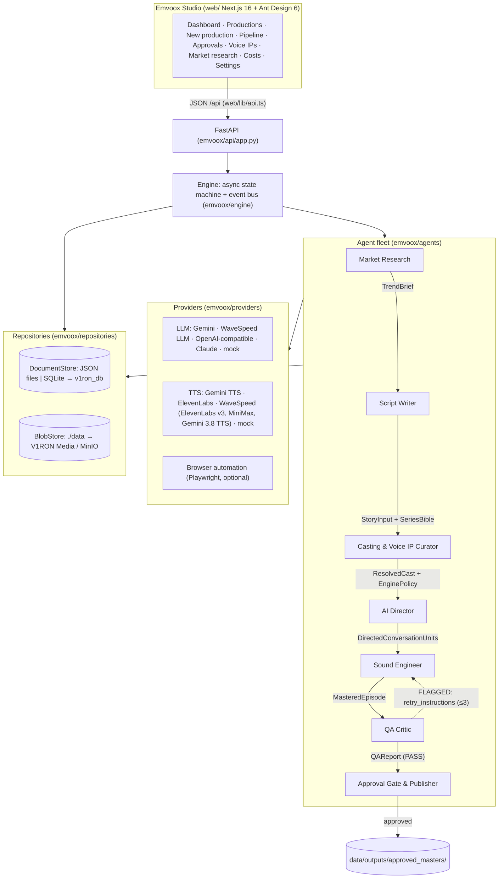
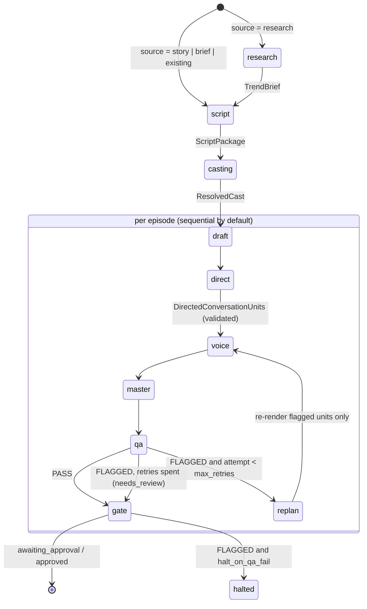
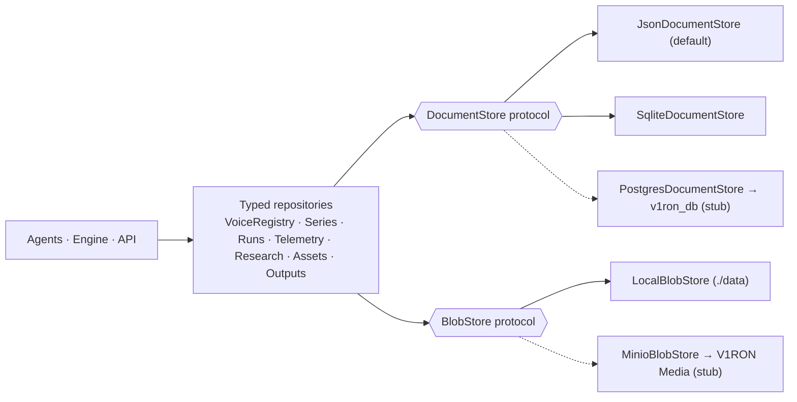

# Emvoox Engine: architecture (Prototype V1)

| | |
|---|---|
| Status | Implemented. Offline end-to-end demo and 104 tests passing; live vendor runs pending the WaveSpeed key |
| Date | 2026-10-03 |
| Replaces | the stage-script pipeline (`pipeline/`, `.claude/skills/*/scripts/`), `docs/ARCHITECTURE.md` v0, `docs/IMPLEMENTATION_PLAN.md`, `docs/System_Flow_Map.*`, `docs/Technical_Specification.md` (still in git history) |
| Sources | `emvox.docs/emvox technical map.png`, `emvox.docs/TỔNG HỢP DỰ ÁN EMVOOX VÀ KÊNH MẶC KHẢI.pdf`, `docs/Emvox_Technical_Map.md` |

Emvoox is an AI entertainment studio: fixed Virtual Actors (own voice, own look) perform Vietnamese micro-dramas, and
audio is the cheap funnel that decides which series earn a video budget. **Emvoox Engine** is the production system
for that funnel: seven agents with typed contracts, an event-driven state machine that runs them, a QA loop that fixes
what it can before a human signs off, and a data layer that can move to V1RON OS without touching agent code.

---

## 1. System at a glance


```mermaid
flowchart TB
  subgraph Studio["Emvoox Studio (web/ Next.js 16 + Ant Design 6)"]
    UI["Dashboard · Productions · New production · Pipeline · Approvals · Voice IPs · Market research · Costs · Settings"]
  end
  UI -->|"JSON /api (web/lib/api.ts)"| API["FastAPI (emvoox/api/app.py)"]
  API --> ENG["Engine: async state machine + event bus (emvoox/engine)"]

  subgraph Fleet["Agent fleet (emvoox/agents)"]
    direction TB
    MR["Market Research"] -->|TrendBrief| SW["Script Writer"]
    SW -->|"StoryInput + SeriesBible"| CA["Casting & Voice IP Curator"]
    CA -->|"ResolvedCast + EnginePolicy"| DI["AI Director"]
    DI -->|DirectedConversationUnits| SE["Sound Engineer"]
    SE -->|MasteredEpisode| QA["QA Critic"]
    QA -->|"QAReport (PASS)"| PU["Approval Gate & Publisher"]
    QA -.->|"FLAGGED: retry_instructions (≤3)"| SE
  end
  ENG --> Fleet

  subgraph Providers["Providers (emvoox/providers)"]
    LLM["LLM: Gemini · WaveSpeed LLM · OpenAI-compatible · Claude · mock"]
    TTS["TTS: Gemini TTS · ElevenLabs · WaveSpeed (ElevenLabs v3, MiniMax, Gemini 3.8 TTS) · mock"]
    BR["Browser automation (Playwright, optional)"]
  end
  Fleet --> Providers

  subgraph Data["Repositories (emvoox/repositories)"]
    DS[("DocumentStore: JSON files | SQLite → v1ron_db")]
    BS[("BlobStore: ./data → V1RON Media / MinIO")]
  end
  Fleet --> Data
  ENG --> Data
  PU -->|approved| OUT[("data/outputs/approved_masters/")]
```

One series flows through three series steps and six episode steps:

| Step | Agent | Skills | Output contract | Stored at (`data/series/<id>/…`) |
|---|---|---|---|---|
| `research` (optional) | Market Research | Market Scan, Content Analyze, Trend Ranking | `TrendBrief` | `trend_brief.json` (+ `research/briefs/<id>.json`) |
| `script` | Script Writer | Story Adapt, Episodize (outline) | `ScriptPackage` = `StoryInput` + `SeriesBible` | `story.json`, `story_raw.txt`, `series.json` |
| `casting` | Casting & Voice IP Curator | Voice Registry, Casting Match, Engine Policy | `ResolvedCast` (+ `EnginePolicy`) | `cast.json`, `assets/voice_registry.json` |
| `epNN.draft` | Script Writer | Episodize (draft), Cliffhanger Check | `EpisodeDraftResult` (+ `CliffhangerCheck`) | `scripts/raw/epNN.txt`, `scripts/checks/epNN.json` |
| `epNN.direct` | AI Director | Parse Script, Delivery Compile, Render Plan | `DirectedConversationUnits` | `scripts/parsed/epNN.json`, `directed/epNN.json` |
| `epNN.voice` | Sound Engineer | Generate Voice | `VoiceRenderResult` | `stems/epNN/*.wav` + `.meta.json`, `render.json` |
| `epNN.master` | Sound Engineer | Generate SFX, Assemble Audio | `MasteredEpisode` | `timelines/`, `masters/epNN_master.{wav,mp3,json}` |
| `epNN.qa` | QA Critic | QA Audio, Review Audio | `QAReport` | `qa/epNN_report.json` |
| `epNN.gate` | Approval Gate & Publisher | Approval Gate, Publish Metadata, Local Export | `ReleasePackage` | `release/epNN.json`, `outputs/approved_masters/<id>/` |

---

## 2. Agents

Every agent is a class in `emvoox/agents/` with a small set of skills (methods), one output contract, and nothing
else: no file paths, no vendor SDKs, no knowledge of the other agents. It receives an `AgentContext` (settings,
repositories, LLM client, telemetry ledger, run parameters, a log sink, a cancel flag) and returns a Pydantic model.

### 2.1 Market Research Agent (`market_research.py`)
- **Market Scan**: observations from text pasted into the run, every `.md/.txt/.json` under `data/inputs/trends/`, and
  (when `use_browser` / `EMVOOX_RESEARCH_USE_BROWSER`) the visible text of public pages on DramaBox, ReelShort, TikTok,
  Google and YouTube through headless Chromium (Playwright, optional extra; sources in `DEFAULT_SOURCES` or
  `inputs/market_sources.json`). No per-site selectors: the page text goes to the model, so a redesign of a site does
  not break the scan. A robot check, login wall or error page is recorded as **blocked** and never worked around.
- **Scan record**: every source is a `ScanStep` (status, characters read, excerpt, screenshot) in a `ScanState`
  document saved after each step. `POST /api/research/scan` starts the agent in a background thread and returns the
  scan; the Market research page polls `GET /api/research/scans/{id}` once a second and shows the pages being read.
- **Content Analyze**: one LLM call → `MarketAnalysis`: insights per reference title, and the **three most trending
  genres**, each with its evidence from the data, the platforms it was seen on, a new story direction, three 1-10
  ratings (audience fit, momentum, production fit) and the nearest Mặc Khải content line (`urban_ceo`,
  `intellectual_slap_anti_trope`, `rebirth_butterfly_effect`, or `other`). The editor's free-text `guide` steers it.
- **Trend Ranking**: deterministic score `0.45·audience_fit + 0.30·momentum + 0.25·production_fit`; genres on the
  editor's `focus` line rank first; the top three are kept in the `TrendBrief`.
- **Human pick**: the editor chooses one of the three (`POST /api/research/briefs/{id}/select`); the brief's top-level
  fields (topic, hook, premise, genre…) mirror the pick and that is what the Script Writer's Story Adapt receives. A
  run started with `source = research` does not stop for the pick and uses the top-ranked genre.

### 2.2 Script Writer Agent (`script_writer.py`)
- **Story Adapt**: `TrendBrief` → `StoryInput` (title, 2-5 roles each with their own goal and motive, an act-by-act
  treatment). Skipped when a human supplies the story.
- **Episodize**: the outline call splits the story into N episodes (`SeriesBible`: premise, tone, role list with role
  types, episode plans that each end on a cliffhanger). Mode is picked from input length: *segment* keeps the author's
  dialogue verbatim (verbatim ratio checked, one retry), *write* expands a treatment (word floor enforced). Roles leave
  this agent **uncast**: casting belongs to the next agent. Then one draft call per episode renders the screenplay.
- **Roster limit**: Story Adapt and the outline are told how many female and male Voice IPs exist
  (`casting.roster_capacity`) and may not write more *named* roles (protagonist, antagonist, supporting) of either
  gender; a version that exceeds it is sent back once. Whatever still does not fit (for example a pasted script with a
  large cast) is demoted to a background role (`minor`). Every role carries an explicit `gender`, which decides the
  voice. Drafts may not add speaking characters.
- **Cliffhanger Check**: an LLM editor scores the hook 1-10 and checks the Emvoox **Anti-Trope rules**
  (`contracts/script.py::ANTI_TROPE_RULES_VI`): independent motivations, a twist within ~30 s (≈100 words), a smart
  antagonist, prepared reveals, consequences, a resolved ending. Below `EMVOOX_CLIFFHANGER_MIN_SCORE` (6) a write-mode
  episode is rewritten once with the critique; segment mode keeps the author's text and flags it. A rule-based check
  stands in when the LLM check is off or fails.

### 2.3 Casting & Voice IP Curator Agent (`casting.py`)
- **Voice Registry**: reads the locked registry; adds a voice on an engine an actor does not have yet (an addition, so
  the lock is not involved). The agent **never adds a character**: Voice IPs are created by people (Voice IPs page, API).
  A Voice IP profile describes the voice and personality only, never a story: one IP plays many roles across series.
- **Casting Match**: named roles are always played by Voice IPs: director pins (`/ngan` in the story form, or the
  dropdown) → an LLM proposal over the free actors (gender, age, persona, timbre; a proposal whose gender does not match
  the role is rejected) → a rule-based gender match. Background roles (`minor`) take a Voice IP that is still free,
  otherwise a **temporary voice** that exists only in that production's `cast.json` and is kept across its later runs.
  One actor plays one role per series.
- **Engine Policy**: per actor, the first available of `by_actor` → the actor's **cloned / preferred voice** (when
  `prefer_cloned`) → `by_role_type` (e.g. protagonist on ElevenLabs, minor roles on Gemini) → the run's default engine.
  An engine whose key is missing is skipped with a run note. WaveSpeed reuses an actor's ElevenLabs voice id through its
  hosted ElevenLabs v3 endpoint. `tier: final` refuses temporary voices on named roles. Output: `ResolvedCast` with, per role, the
  actor, provider, model, voice id, voice source (`prebuilt | premade | library | cloned | placeholder`) and the voice's
  identity settings.

### 2.4 AI Director Agent (`director.py`)
- **Parse Script**: one structured LLM call → `EpisodeScript` (scenes, lines, actor id + role name, emotion enum,
  intensity 1-10, ≤2 approved audio tags, acoustic direction, pace, volume, pause after). Post-conditions the schema
  cannot express are enforced in code (every speaker is in the resolved cast, protagonist alias resolved). Two rejected
  answers fall back to a rule-based reading of the screenplay with neutral delivery and a run note, so production is
  never blocked by a malformed answer.
- **Delivery Compile** (`delivery/compile.py`): per line and engine, the normalized Vietnamese text (`text/vi_normalize.py`),
  tags kept where the engine reads them (ElevenLabs v3, WaveSpeed's ElevenLabs endpoint) or folded into a Vietnamese
  acting direction (Gemini), and the settings vector (v3 discrete stability, v2 continuous stability/style, MiniMax
  emotion/speed/volume). The voice's own `default_settings` (a cloned voice's identity anchor) are never overridden.
- **Render Plan** (`delivery/plan.py`): consecutive lines of one scene on a multi-speaker engine (Gemini) with ≤2 actors
  become one *conversation* request (1-3 requests per episode instead of 8-12); everything else is one request per line.
  Mixed engines in one scene are supported. The plan is part of the contract.
- **Output contract** `DirectedConversationUnits`: ordered units with `speaker_id`, `text`, `tts_text`, `emotion_tag`,
  `emotional_intensity`, `audio_tags`, `direction`, `pause_after_ms`, `speed`, `pitch`, `volume`, the resolved
  provider/model/voice and settings; plus the `render_plan` (validators: sequential order, ids belong to the episode,
  every spoken unit covered exactly once).

### 2.5 Sound Engineer Agent (`sound_engineer.py`)
- **Generate Voice**: executes the render plan through the TTS adapters; canonical stems (WAV 44.1 kHz / 16-bit / mono)
  with a sidecar per stem (content hash, request, cost, alignment, attempt). A stem is regenerated only when the hash of
  (provider, model, voice, final text, settings, speakers, retry attempt) changes. Bounded thread pool (Gemini serial for
  free-tier RPM). ElevenLabs "paid plan required" on a library/cloned voice → the actor's premade fallback, flagged.
- **Generate SFX**: cues from `assets/sfx/<tag>.wav`, or generated with ElevenLabs sound effects when `ENABLE_SFX` and the
  key are set (then cached in the library). Off by default (D6).
- **Assemble Audio** (`audio/`): timeline from measured stem durations (Director pauses clamped to 300-500 ms, `pause`
  units kept whole, 800 ms scene gaps, 500 ms tail), optional music bed from `assets/bgm/<mood>/` looped under the
  speech and ducked by sidechain compression (`ENABLE_BGM`, off by default per D5), SFX at their offsets, two-pass
  loudnorm to **-16 LUFS / -1.5 dBTP**, stereo WAV + MP3 192 kbps. Output `MasteredEpisode` with measured loudness.

### 2.6 QA Critic Agent (`qa_critic.py`)

| Check | Method | Issue code | Severity | Retry action |
|---|---|---|---|---|
| Stem present for every render unit | storage | `missing_stem` | blocker | `rerender` |
| Missing sentence | stem duration < 45 % of what its words need at 3.6 w/s | `missing_sentence` | major | `rerender`; a conversation chunk → `rerender_line_mode` |
| Extra speech / spoken direction | duration > 240 %, or transcript has header words | `duration_off`, `direction_leak` | major | same |
| Clipping | `astats` peak ≥ -0.1 dBFS | `clipping` | major | `rerender` (more stable settings) |
| Silence inside a stem | `silencedetect` -50 dB ≥ 1.5 s, or a silent stem | `long_silence` | major | `rerender` |
| Speaker mismatch | sidecar voice ≠ resolved cast voice | `speaker_mismatch` | major | `rerender` |
| Placeholder voice | ElevenLabs plan fallback used | `placeholder_voice` | minor | none (human decides) |
| Master loudness / true peak | `ebur128` vs target ±1 LU, TP ≤ target + 0.1 | `loudness_off`, `true_peak_over` | major | `reassemble` |
| Master duration | 50-160 % of the target | `master_duration_off` | minor | none (script length) |
| Mispronunciation (optional) | `EMVOOX_QA_TRANSCRIBE`: LLM transcript of each stem, word error rate > 25 % | `mispronunciation` | major | `rerender` |

Score = 100 - 25·blocker - 12·major - 3·minor. **FLAGGED** when any blocker/major remains or the score is below
`EMVOOX_QA_PASS_SCORE` (80). Every issue carries the render unit, the line and its **timestamp in the master**
(`at_ms`). Lines a human should hear anyway (intensity ≥ 9, intense monologues) are listed in `review_lines`.

### 2.7 Human Approval Gate & Publisher (`publisher.py`)
- **Approval Gate**: nothing is exported without a human. PASS → `awaiting_approval`; still FLAGGED after the retries →
  `needs_review` with the reason. `auto_approve` exports PASS episodes only. Approving a FLAGGED episode is allowed and
  recorded as an override. A reviewer name is required.
- **Publish Metadata**: YouTube title, description (with the AI-voice disclosure), tags, hashtags, playlist, thumbnail
  text; LLM with a rule-based fallback; editable at the gate.
- **Local Export**: approved WAV + MP3 + `<ep>.youtube.json` to `data/outputs/approved_masters/<series>/`, and a
  publishing mock-up receipt (`ready_for_upload`). The upload itself is not wired in Prototype V1.

---

## 3. Engine (`emvoox/engine/`)


```mermaid
stateDiagram-v2
  [*] --> research: source = research
  [*] --> script: source = story | brief | existing
  research --> script: TrendBrief
  script --> casting: ScriptPackage
  casting --> draft: ResolvedCast
  state "per episode (sequential by default)" as EP {
    draft --> direct
    direct --> voice: DirectedConversationUnits (validated)
    voice --> master
    master --> qa
    qa --> gate: PASS
    qa --> replan: FLAGGED and attempt < max_retries
    replan --> voice: re-render flagged units only
    qa --> gate: FLAGGED, retries spent (needs_review)
  }
  gate --> [*]: awaiting_approval / approved
  gate --> halted: FLAGGED and halt_on_qa_fail
```

- **Async state machine.** `Engine.run()` is a coroutine; each step is one agent call in a worker thread
  (`asyncio.to_thread`), so cancellation is honoured between steps and the API stays responsive. Episodes run in
  order (D12, vendor rate limits); `episode_concurrency > 1` runs several under a semaphore.
- **Handoff validation.** Each step declares its output contract; the engine re-validates the payload
  (`Model.model_validate(result.model_dump())`) and runs cross-checks before the next agent sees it (e.g. the Director's
  units must use exactly the cast's voices). A rejected handoff publishes `contract.rejected`, is retried once when the
  agent says it is retryable, and otherwise fails the step and skips the rest of that episode.
- **Event-driven.** Every transition is a `PipelineEvent` on the `EventBus` (`run.started`, `step.started`,
  `step.finished`, `step.failed`, `step.retry`, `contract.rejected`, `cast.resolved`, `qa.flagged`, `gate.waiting`,
  `gate.approved`, `episode.stopped`, `run.finished`). Subscribers persist `RunState` and append the event log the UI
  tails (`GET /api/runs/{id}/events?after=N`); V1RON OS can subscribe the same way later.
- **QA retry loop.** On FLAGGED with retry instructions and attempts left (default 3): the Director re-plans from the
  saved script without an LLM call (flagged chunks split into lines, attempt numbers bumped so settings move toward the
  engine's most stable delivery and the cache key changes), the Sound Engineer re-renders only the affected units,
  re-masters, and the QA Critic checks again. Telemetry counts `qa_retries`.
- **Human gate and halting.** The gate parks every episode. With `halt_on_qa_fail` (default) an episode still FLAGGED
  after the retries halts the run (`status: halted`) so no further credits are spent before a human looks.
- **Resume and idempotency.** `only=[…]` produces just those episodes; the outline, drafts and directed scripts that
  exist are kept, stems are reused by content hash. A server restart marks in-flight runs `cancelled` (artifacts stay).
- **Run state** (`RunState`): steps with status / attempts / timing / cost / summary, notes for humans, the casting
  table, totals (cost, LLM calls, tokens, TTS requests, characters, audio, QA retries) and the engines used.

---

## 4. Data layer (`emvoox/repositories/`)


```mermaid
flowchart LR
  A["Agents · Engine · API"] --> R["Typed repositories<br/>VoiceRegistry · Series · Runs · Telemetry · Research · Assets · Outputs"]
  R --> D{{"DocumentStore protocol"}}
  R --> B{{"BlobStore protocol"}}
  D --> J["JsonDocumentStore (default)"]
  D --> S["SqliteDocumentStore"]
  D -.-> P["PostgresDocumentStore → v1ron_db (stub)"]
  B --> L["LocalBlobStore (./data)"]
  B -.-> M["MinioBlobStore → V1RON Media (stub)"]
```

- Every artifact has one **key**: a POSIX path relative to the storage root, built only by `emvoox/paths.py`
  (`series/<id>/directed/ep01.json`, `assets/voice_registry.json`, …). Locally the key is a file under `./data`; on V1RON
  it is the document id in `v1ron_db` and the object name in MinIO.
- `DocumentStore`: `get/put/delete/exists/list/append/read_log/mtime/delete_prefix`. Two local implementations honour the
  same contract test (`tests/test_repositories.py`): one JSON file per document (default, human-readable, diffable) and
  SQLite (`EMVOOX_DOC_STORE=sqlite`, the shape a PostgreSQL JSONB table takes).
- `BlobStore`: `path/commit/local/exists/list/...`. FFmpeg and the SDKs need real files, so a remote store hands out a
  local cache path; `commit()` uploads after writing, `local()` downloads on a miss. Locally both are no-ops.
- **Moving to V1RON OS** = implement `PostgresDocumentStore` and `MinioBlobStore` in `repositories/v1ron.py` and set
  `EMVOOX_STORAGE=v1ron`. Agents, engine and API do not change.

Local layout (`./data`, `EMVOOX_DATA_DIR`):

```
data/
  assets/voice_registry.json      locked Voice IP registry (global)
  assets/previews/, auditions/    cached voice previews, ad-hoc auditions
  assets/bgm/<mood>/, assets/sfx/ music beds and effect clips (optional)
  inputs/trends/*.md|txt|json     trend notes for the Market Research Agent; inputs/market_sources.json (browser targets)
  research/briefs/<id>.json       TrendBriefs
  research/scans/<id>.json        scan records (progress, sources, log); research/scans/<id>/*.jpg page screenshots
  series/<id>/                    story, bible, cast, scripts, directed units, stems, timelines, masters, qa, release,
                                  run.log.jsonl (ledger), pipeline_run.json (run state), logs/ (step logs, events.jsonl)
  outputs/approved_masters/<id>/  epNN.mp3, epNN.wav, epNN.youtube.json (approved only)
  telemetry/run_log.jsonl         ledger rows not tied to a series (previews, research, auditions)
  telemetry/usage_events.jsonl    vendor 429 / 402 / quota events
```

---

## 5. Providers (`emvoox/providers/`)

| Kind | Provider | Adapter | Notes |
|---|---|---|---|
| LLM | Gemini (`gemini-3.1-flash-lite` default) | `llm/gemini.py` | Pydantic `response_schema`, retries on 429/5xx, IPv4 pin, audio transcription for Review Audio |
| LLM | **WaveSpeed LLM** (`https://llm.wavespeed.ai/v1`) | `llm/openai_compat.py` | OpenAI Chat Completions protocol, `vendor/model` ids (Gemini, Claude, GPT, DeepSeek…), JSON mode + schema in the prompt + one repair round |
| LLM | OpenAI or any compatible gateway | `llm/openai_compat.py` | same adapter, `OPENAI_API_KEY` |
| LLM | Claude | `llm/anthropic_llm.py` | official SDK, `messages.parse(output_format=…)`, optional extra `.[claude]` |
| LLM | mock | `llm/mock.py` | deterministic, schema-valid Vietnamese template story; offline demo and tests |
| TTS | Gemini TTS | `tts/gemini.py` | 30 prebuilt voices, multi-speaker conversation requests, direction prefix, free-tier quota fail-fast |
| TTS | ElevenLabs | `tts/elevenlabs.py` | `eleven_v3` + v2/flash, any account voice (cloned included), alignment, tier-gated format fallback |
| TTS | **WaveSpeed** | `tts/wavespeed.py` | `POST /api/v3/<model path>` → poll `/predictions/{id}/result` → download; `elevenlabs/eleven-v3` (any ElevenLabs voice id), `minimax/speech-2.6-hd` (system or cloned ids, emotion/speed/pitch/volume). Submissions are never blindly retried (a lost response may still be billed); `google/gemini-3.8-flash[-lite]/text-to-speech` (the actor's Gemini voice name, `style_instructions`, two-speaker dialogue as `speakers` + `turns`; billed per request per started 1,000 characters, hence scene batching) |
| TTS | mock | `tts/mock.py` | tones at the canonical stem format; fault injection (`clip`, `truncate`, `silence`, `error`) for the QA loop |

Every call goes through `LlmClient.structured(...)` or a `TtsProvider.synthesize(...)`, which is where validation,
retries and telemetry live. A new engine (for example a self-hosted model serving the team's cloned voices) is one class
with `synthesize(req, out)` plus `register_provider("name", factory)` and a catalog entry; the Director needs no change
because delivery is compiled per engine.

---

## 6. Voice IPs and cloned voices

- The registry (`data/assets/voice_registry.json`, model `VoiceRegistry`) holds actors (`CharacterProfile`: persona,
  voice description, gender, age, tags) and one `ProviderVoice` per engine (`voice_id`, `model_id`, `source`, `label`,
  `fallback_voice_id`, `default_settings`, `added_at`) plus `preferred_provider`.
- **Lock rule** (only in `VoiceRegistryRepository`): changing or removing an IP asset's existing voice needs `unlock`
  and is written to the changelog; adding a voice on a new engine does not.
- **Plugging in a cloned voice** (web: Voice IPs → "Plug in cloned voice"; CLI: `python -m emvoox plug-voice`; API:
  `POST /api/characters/{id}/voices`): stores it with `source: cloned` and, by default, makes that engine the actor's
  preferred one. The next run's Engine Policy renders the actor on that voice whenever the engine's key is configured.
  ElevenLabs PVC/IVC voice ids work directly and through WaveSpeed's ElevenLabs endpoint; MiniMax clones (WaveSpeed
  `minimax/voice-clone`) work through `minimax/speech-2.6-hd`.

---

## 7. Cost and audit telemetry (`emvoox/telemetry/`)

- `UsageRecord` per LLM call (tokens in/out), TTS request (characters, audio ms, tokens for Gemini), SFX, and agent step
  (execution time), stamped with run, series, episode, agent and skill, plus an **estimated cost** from
  `telemetry/pricing.py` (list prices from `docs/Cost_and_Pricing_Research.md`; override in `data/assets/pricing.json`).
- Written to `series/<id>/run.log.jsonl` (or `telemetry/run_log.jsonl`); pre-refactor rows are normalized and priced.
- `GET /api/costs`: totals (all time, month, today), by provider, model, agent, series (cost per audio minute), by day,
  recent records, the pricing basis, and the WaveSpeed balance. `GET /api/usage`: per-model quota status (Gemini daily
  free-tier quota with reset countdown, ElevenLabs subscription counters, vendor 429/402 events).

---

## 8. Web app and API

`web/` is a Next.js 16 static export with Ant Design 6 (navy `#284979`, light and dark themes), served by the API at
`/` (`python -m emvoox serve`, port 8765) or run with `npm run dev`. Pages: **Dashboard** (KPIs, productions in
progress, attention queue, cost trend), **Productions** (library, episode players, episode drawer with script, directed
units, QA report and release), **New production** (wizard: source = trend brief / own story / research now → story and
roles → engines and QA policy → review), **Pipeline** (agent flow, episode × step matrix with retries, live logs,
casting, event timeline), **Approvals** (the human gate: listen, timestamped QA issues, edit metadata, approve /
reject, exported files), **Voice IPs** (actors, previews per engine, cloned-voice plug-in), **Market research**
(scan, briefs, ranked candidates), **Costs** (spend and quotas), **Settings** (health checks, keys, agent fleet).

The full route list is at the top of `emvoox/api/app.py`; `web/lib/api.ts` is the typed contract both sides follow.

---

## 9. Configuration

All settings come from `emvoox/config.py::get_settings()` (`.env`, `EMVOOX_*`, legacy `AI_AUDIO_*` still read). The
important ones: `EMVOOX_LLM_PROVIDER/MODEL`, `EMVOOX_TTS_PROVIDER/MODEL/BATCHING`, `EMVOOX_PREFER_CLONED_VOICES`,
`EMVOOX_STORAGE`, `EMVOOX_DATA_DIR`, `EMVOOX_DOC_STORE`, `ENABLE_BGM`, `ENABLE_SFX`, loudness and padding,
`EMVOOX_QA_MAX_RETRIES`, `EMVOOX_QA_PASS_SCORE`, `EMVOOX_QA_TRANSCRIBE`, `EMVOOX_CLIFFHANGER_*`, `EMVOOX_AUTO_APPROVE`,
`EMVOOX_HALT_ON_QA_FAIL`, `EMVOOX_RESEARCH_USE_BROWSER`. See `.env.example`; keys and accounts in `docs/SETUP.md`.

---

## 10. Testing and the demo

- `python scripts/demo_pipeline.py` runs research → master → gate → approval offline with an injected fault, prints
  every step, the QA retry and the telemetry. `--live --llm wavespeed --tts wavespeed --episodes 1` runs the same on real vendors.
- `pytest` (104 tests, no network: sockets are blocked and `.env` is not loaded under test): contracts, normalizer,
  delivery compile and render plan, provider adapters on fake transports (Gemini, ElevenLabs, WaveSpeed TTS + LLM),
  repositories (JSON and SQLite against one contract), agents (casting policy with cloned voices, QA measurements on
  synthetic audio, mastering with a ducked bed), the engine end to end (retry loop, halting, auto-approve, contract
  rejection, rule-based fallback, research-to-master, resume), and the HTTP API.

---

## 11. Decisions

Locked decisions D1-D12 (CLAUDE.md) still hold, with D2, D4, D7 and D10 extended as below. New decisions taken in this
refactor, each with the reason; numbered so the Lead Architect can confirm or override them one by one:

| # | Decision | Why |
|---|---|---|
| E1 | Orchestration is a native asyncio state machine with Pydantic contracts, not LangGraph or CrewAI | the flow is a fixed graph with one loop; a framework adds dependencies (and Python 3.14 risk) without adding control; every step stays a plain, testable function |
| E2 | Storage behind `DocumentStore` + `BlobStore` with keys = relative paths; JSON files by default, SQLite optional | local-first now, one adapter pair to reach v1ron_db + MinIO later |
| E3 | Audio processing stays FFmpeg via subprocess (`audio/`), no pydub | two-pass loudnorm hits -16.0 LUFS exactly; pydub was dropped earlier for that reason |
| E4 | LLM abstraction is a thin adapter layer (Gemini SDK, OpenAI-compatible HTTP for WaveSpeed/OpenAI, Anthropic SDK), not LiteLLM/LangChain | structured output per vendor is the hard part and each adapter does it natively; WaveSpeed already aggregates models behind one protocol |
| E5 | Casting moves out of the outline call into its own agent; roles leave the Script Writer uncast | matches the technical map; lets cloned-voice preference and engine policy decide per actor |
| E6 | The QA loop re-plans and re-renders only flagged units, at most `max_retries` (3), with progressively more stable engine settings; then a human decides | bounded cost, deterministic, auditable (each attempt is in the stem sidecar and the cache key) |
| E7 | Nothing is published without a human; FLAGGED episodes halt the run by default | capital efficiency: stop spending before someone listens |
| E8 | The Director falls back to rule-based direction after two rejected LLM answers | a malformed answer should cost a note, not a stalled batch |
| E9 | Gemini remains the default engine; ElevenLabs and WaveSpeed are per-run or per-actor choices; a cloned voice wins whenever its engine has a key | testing stays cheap; IP voices are used as soon as they exist |
| E10 | The Market Research browser scan is optional and selector-free | public pages change and block bots; local trend notes are the supported path until V1RON's automation fleet |

## 12. Not built yet (roadmap)

1. **V1RON OS**: `PostgresDocumentStore` + `MinioBlobStore`, the V1RON API provider for LLM/TTS (register as a provider),
   a worker process so runs survive API restarts, the V1RON browser automation fleet behind Market Scan.
2. **Publishing**: the YouTube upload (OAuth) behind the existing `ReleasePackage`; retention analytics feeding the
   Market Research Agent.
3. **Director v2** (from the former Technical Specification): engine-neutral delivery cues, ElevenLabs Text-to-Dialogue
   conversation units with per-line segments, an identity-anchored modulation model per cloned voice, an LLM delivery
   judge for peak lines.
4. **Video pipeline** (Visual Development, Storyboard, Video Director, Editor, QA Video; see the video map in
   `docs/Emvox_Technical_Map.md`) for series that prove themselves in audio. The Dashboard already reserves a Video view.
