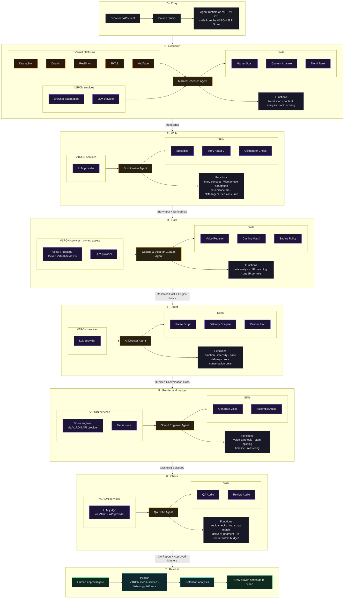

# Emvox Technical Map (pitch deck source)

| | |
|---|---|
| Purpose | Source text for the three technical-map slides in the Emvox investor deck |
| Date | 2026-09-24 |
| Slides | Design canvas "Emvox Technical Map": Technical Map (all layers), Layer 01 Why and who, Layer 03 Differentiation and V1RON OS |
| Rules | No code artifacts or internal paths, no vendor quirks or workarounds, no unbounded autonomy claims: every agent is bounded by contracts, budgets and a human approval gate |

## What Emvox is

An AI studio that writes, casts, directs, voices, masters and checks serialized audio micro-drama with a fixed cast
of Virtual Actor IPs, Vietnamese-first. One story becomes 30 audio episodes of 50 to 70 seconds in under a day;
retention data from audio decides which stories earn a video budget.

## Layer 01: strategic intent and metrics (why and who)

| Metric | Claim | How the pipeline delivers it | What it means for the business |
|---|---|---|---|
| Speed | under 24 hours end-to-end per 30-episode series, human review included | six agents run as one automated chain, episode by episode; a whole scene is voiced in one or a few requests; human review sees a queue of flagged lines; a daily plan sizes work against vendor quotas before spending | a series can be on air the day after the script exists, so many stories can be tested per month |
| Unit cost | about $1.00 to $3.50 per 30-minute finished master, 80 to 90 percent below traditional production | voice synthesis is the only significant variable cost; writing, directing and judging cost cents per episode; every stem is cached by content and never rendered twice; two voice engines behind one policy (low-cost for testing, premium Virtual Actor voices for proven series); platform on owned hardware | a story is proven with listeners for a few dollars before any video budget is committed |
| Consistency | zero acoustic drift across 30+ serialized episodes | locked registry of Virtual Actor IPs, one actor per role, audited unlock to change a voice; emotion performed inside each actor's identity envelope; the same directing contract from episode 1 to 30; QA compares each episode's voices to the actor's reference | recurring characters are what audiences return for and they accumulate fans across series |

Who it serves: Vietnamese micro-drama listeners paying per 60 to 120 second episode. Market signal (DataEye 2025):
95.37 percent of standalone micro-dramas never break 50M heat; 7 of the 10 titles above 100M were series with
recurring characters. Funnel: 1 story, 30 audio episodes, retention data, only winners get video.

## Layer 02: pipeline capabilities (what), top-down

Entry: Browser or API client, then Emvox Studio (a domain stack on V1RON OS: create series, watch runs, review and
approve), then the agent runtime (V1RON MCP gateway with skills hot-loaded from the Skill Store). Every phase reads
and writes a validated contract, so any phase can be re-run alone. Phases run in order, one series at a time,
episode by episode.

### Pipeline map (single slide)

| # | Agent | Functions | Skills (on V1RON MCP) | Provider calls (via V1RON OS) | Output |
|---|---|---|---|---|---|
| 1 | Market Research Agent: finds what audiences want next. Sources: DramaBox, Douyin, ReelShort, YouTube, TikTok | trend scan; content analysis of hits (genre, hook, pacing); topic scoring against our audience; reference brief | Market Scan, Content Analyze, Trend Rank (custom skills) | browser automation fleet (Playwright) for deep research; LLM analysis through the V1RON API provider | Trend Brief: genres, hooks, references, audience fit |
| 2 | Script Writer Agent: turns a brief into a 30-episode Vietnamese series | story concept; adaptation to Vietnamese culture and speech; 30-episode arc with a cliffhanger every episode; tension curve across the season | Episodize, Story Adapt VI, Cliffhanger Check | LLM calls with structured, schema-validated output, one per series plus one per episode | StoryInput + SeriesBible (cast list, 30 episode plans, tension curve) |
| 3 | Casting and Voice IP Curator Agent: gives every role a locked Virtual Actor | role analysis; match to owned Voice IP assets on gender, age, persona and voice; one IP per role, director pins respected; engine policy per production tier | Voice Registry, Casting Match, Engine Policy | LLM matching call; lookup in the owned, locked Voice IP registry | Resolved Cast + Engine Policy (role to Virtual Actor IP to voice per engine) |
| 4 | AI Director Agent: directs every line | line-by-line delivery (emotion, intensity, pace, pauses); engine-neutral delivery cues; conversation units; modulation inside each actor's identity envelope | Parse Script, Delivery Compile, Render Plan | one LLM call per episode, schema-validated; no audio spend | Directed Conversation Units + Settings |
| 5 | Sound Engineer Agent: renders, cuts and masters | TTS per conversation unit; stem splitting per line; timeline from measured durations; FFmpeg mastering to -16 LUFS; content-hash cache | Generate Voice, Assemble Audio | ElevenLabs TTS and Gemini TTS metered through the V1RON API provider; V1RON media store | Stems + draft timelines, then mastered episodes (WAV and MP3 at broadcast loudness) |
| 6 | QA Critic Agent: checks, judges, fixes within budget, escalates | deterministic checks (duration, clipping, silence, loudness); transcript match against the script; delivery and identity judgment on peak lines; bounded re-render, then a human review queue | QA Audio, Review Audio | LLM judge with audio understanding, only on flagged lines | QA Report + approved masters |

Exit: human approval gate, publish (V1RON media service, CDN delivery, listening apps and platforms), retention
analytics (completion and return rates per episode), only proven series go to video.

## Layer 03: foundation and differentiation (how)

V1RON OS, our own AI operating system, is what Emvox runs on:

1. Skill Store and MCP hot-load: skills ship to agents without a release.
2. Domain stacks: Emvox is one enabled domain beside accounting and HR, with its own service, tools and database.
3. Unified API provider: every LLM and voice call metered in one place; providers can be swapped without touching agents.
4. Media, S3 and files: stems, masters and previews on our own storage with CDN delivery.
5. Browser automation fleet: Playwright, Puppeteer and CDP for market research at scale.
6. Zero-inbound security: Cloudflare tunnel, no open ports, SSO with roles.
7. Own hardware and Docker: near-zero platform cost, no PaaS lock-in.

| Capability | Emvox | AI voice tools | Generic AI content pipelines | Traditional studio |
|---|---|---|---|---|
| Recurring Virtual Actor IPs | locked registry, one actor per role, audited changes | voices exist, no casting or continuity | one-off content, no cast | human actors, availability-bound |
| Consistency across 30+ episodes | identity envelope per voice, QA identity check per episode | manual, per clip | not addressed | yes, at studio cost |
| Turnaround per 30-episode series | under 24 hours, human review included | days of manual editing | varies, no series structure | weeks |
| Cost per 30-minute master | $1.00 to $3.50, cached, never rendered twice | synthesis plus hours of labour | unmetered, re-renders on every edit | actors, studio time, editing |
| Quality control | bounded agents, deterministic checks, human approval gate | listen and redo | unbounded, hard to audit | human, expensive |
| Language and market | Vietnamese-first: adaptation, text normalization, local cues | generic multilingual | English-first | local, not scalable |
| Platform ownership | own OS, own hardware, own data and metering | vendor account | rented cloud, per-seat tools | not applicable |

What this buys Emvox: faster iteration on skills, full cost visibility per episode, ownership of the audience data,
and a platform that already runs other businesses.
