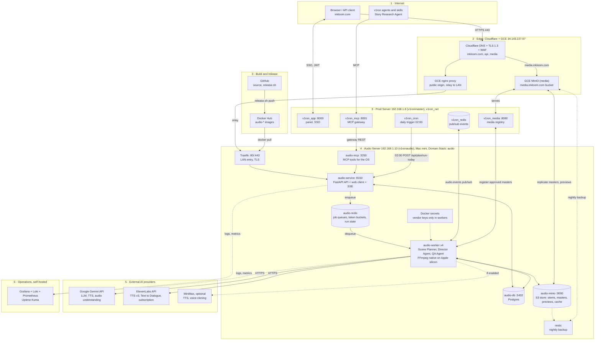
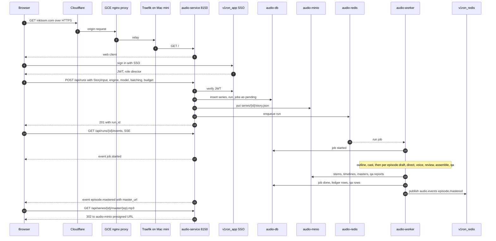
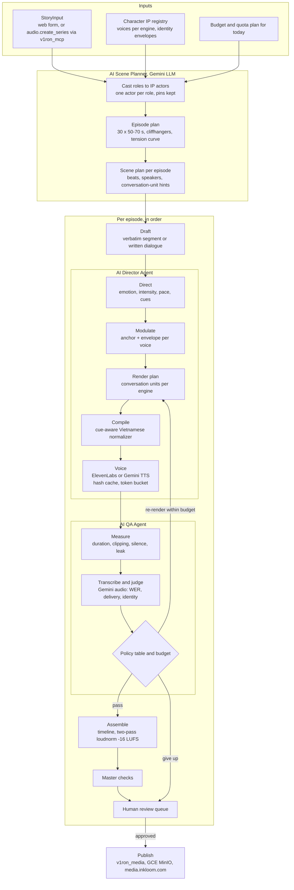
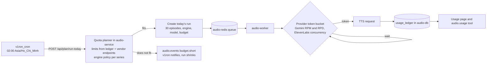

# Inkloom AI Audio Pipeline: production system flow map (proposal)

| | |
|---|---|
| Status | Proposal for running the pipeline in production on our own server (Mac mini) inside the v1ron OS ecosystem |
| Date | 2026-09-23 |
| Audience | Pipeline engineers, the v1ron platform team, the story-agent and voice-cloning tracks, product |
| Companion | `System_Flow_Map.html` (the same map as a tabbed page with zoom and pan), `Technical_Specification.md` (agent designs), `Cost_and_Pricing_Research.md` (vendor costs) |

Diagrams are Mermaid and render in GitHub, VS Code and most Markdown viewers. Colours follow the v1ron tech map legend: **core app / MCP** (purple), **database** (green), **cache / Redis** (red), **domain stack** (teal), **external** (orange), **dev-only** (grey).

---

## 1. How the pipeline fits v1ron OS

Reading the v1ron tech ecosystem map (`app.v1ron.com/v1ronos-tech.html`):

- **Public entry** is a GCE nginx proxy at 34.143.227.97 reached over HTTPS after DNS. It proxies port 8000 to `v1ron_app` on the prod server and relays to the dev server. `update.v1ron.com` and a **GCE MinIO (media)** bucket live on the same GCE host.
- **Prod server 192.168.1.8 (v1ronmaster)** runs the core on one Docker network, `v1ron_net`: `v1ron_app :8000`, `v1ron_mcp :8001` (the MCP gateway), `v1ron_cron`, `v1ron_db :5432`, `v1ron_redis` (cache and pub/sub), `v1ron_media :8080` (REST media service), plus browser automation (`playwright :3000`, `puppeteer :3000`, `v1ron_cdp :4096`).
- **Domain stacks are opt-in** and follow one shape: `<domain>-service :81xx` talks REST to `<domain>-mcp :32xx`, which owns `<domain>-db`. `v1ron_mcp` reaches each domain MCP through a **gateway** edge. Example on the map: `accounting-service :8141`, `accounting-mcp :3241`, `accounting-db`.
- **Release pipeline**: `release.sh` pushes images to Docker Hub; the prod server pulls "domain imgs" from Docker Hub; GitHub holds the source; the dev server gets `version.json` over SSH.

The audio pipeline therefore becomes the **`audio` domain stack**, with one difference from `accounting`: it runs on its own host, the Mac mini, because it needs FFmpeg, local audio storage and long-running workers that should not compete with the core for CPU. It joins v1ron through the same three seams every domain uses: the MCP gateway, Redis pub/sub events, and the media service.

| v1ron seam | What the audio stack does with it |
|---|---|
| `v1ron_mcp :8001` gateway | Gateway edge to `audio-mcp :3250`. Tools exposed: `audio.create_series`, `audio.start_run`, `audio.run_status`, `audio.list_library`, `audio.get_episode`, `audio.approve_episode`, `audio.usage`. The Story Research Agent (a v1ron skill) creates series through this path. |
| `v1ron_app :8000` | Single sign-on: the audio web client and API accept v1ron session tokens (JWT); roles director / reviewer / viewer map to v1ron roles. The audio panel is linked from the v1ron panel. |
| `v1ron_cron` | Fires the daily production plan at 02:00 Asia/Ho_Chi_Minh by calling `audio-service /api/plan/run-today`. No separate scheduler container. |
| `v1ron_redis` pub/sub | `audio-worker` publishes `audio.events` (run started, episode mastered, review needed, budget exhausted) so the OS can notify people or trigger skills. Queues themselves stay in `audio-redis` on the Mac mini. |
| `v1ron_media :8080` and GCE MinIO (media) | Approved masters are registered with `v1ron_media` and replicated from the Mac mini's MinIO to the GCE MinIO media bucket, which serves `media.inkloom.com`. |
| Docker Hub, `release.sh` | `audio-service`, `audio-mcp`, `audio-worker` images are built from GitHub and pushed with the same release script; the Mac mini pulls them like any domain image. |

---

## 2. Domains and edge

| Host | Resolves to | Purpose | TLS / caching |
|---|---|---|---|
| `inkloom.com`, `www.inkloom.com` | Cloudflare DNS → GCE nginx proxy 34.143.227.97 → relay → Traefik on the Mac mini → `audio-service` | Public catalogue and the operator web client (Library, Story, Run board, Characters, Usage, Review queue) | Cloudflare edge TLS 1.3, HSTS; origin certificate on the GCE proxy; HTML not cached |
| `api.inkloom.com` | same path, `/api/*` | JSON API and Server-Sent Events for live run boards | WAF rule 60 requests per minute per IP; CORS limited to `inkloom.com` |
| `media.inkloom.com` | Cloudflare DNS → GCE MinIO (media) bucket | Approved masters and voice previews for players and distribution | CDN cached; unreleased objects only via 1-hour presigned URLs |
| `audio.v1ron.com` (internal alias) | GCE nginx proxy → Traefik on the Mac mini | The same stack reached from inside the v1ron OS | as above |

Cloudflare provides DNS, TLS and WAF only; no application code runs there. The GCE nginx proxy is the single public origin, exactly as it is for `v1ron_app` today.

---

## 3. Production system map

Read top to bottom: layer 1 is who calls us, layer 2 the public edge we already own, layer 3 the v1ron core and the release path, layer 4 the audio domain stack on the Mac mini, layer 5 the paid AI vendors that only workers reach, layer 6 monitoring.

Why this shape:

- **The Mac mini is the audio domain host.** Apple silicon runs FFmpeg and the loudness passes natively and fast; Docker (OrbStack or Docker Desktop) runs the containers; the stack is one `docker compose` project named `audio`, mirroring the `accounting` stack.
- **Workers pull from a queue** in `audio-redis`, so a run survives API restarts (today a restart kills in-process runs). Each stage is still an idempotent job with deterministic file names, now under an S3 prefix in `audio-minio` instead of `series/<id>/` on disk.
- **Provider token buckets live in Redis**, so all workers share one view of the Gemini per-minute and per-day limits and the ElevenLabs concurrency.
- **No third-party PaaS.** Everything is either a self-hosted container on hardware we own, an existing v1ron service, or a paid AI vendor. Cloudflare and GCE stay because v1ron already terminates public traffic there.

---

## 4. Request flow: starting a run from the browser

The API never calls a vendor itself, apart from the cached voice previews and the ElevenLabs subscription read for the Usage page. Every paid call happens in a worker, is written to the ledger, and is retried by the queue rather than by the browser.

---

## 5. Worker pipeline with the three agents

| Agent | Replaces | Vendor calls | Guard rails |
|---|---|---|---|
| AI Scene Planner | outline and the planning half of draft | 1 Gemini LLM call per series, plus 1 per episode when the script is a treatment | user pins enforced in code, one actor per role, episode count and length validated |
| AI Director Agent | direct and voice | 1 Gemini LLM call per episode; 1 to 3 TTS requests on Gemini, about 3 on ElevenLabs with Text to Dialogue | schema-validated script, identity knobs never modulated, per-unit hash cache, shared token buckets |
| AI QA Agent | qa and the missing review loop | Gemini audio understanding, about $0.02 per 30-minute day | at most 2 re-renders per unit, 6 per episode, 10 percent of the episode's characters; the human verdict is the publish gate |

---

## 6. Daily production schedule

---

## 7. Data plane

| Store | Holds | Today's equivalent | Lifecycle |
|---|---|---|---|
| `audio-db` (Postgres) `series`, `episodes` | story input, bible, engine policy, per-episode status, master pointer | `story.json`, `series.json`, folder listings | keep |
| `audio-db` `runs`, `jobs` | orchestrator state, per-job status, summaries, log pointers | `pipeline_run.json`, `logs/` | keep |
| `audio-db` `characters`, `voices`, `voice_identities` | Character IP registry, per-engine voices, lock and changelog, identity envelopes | `library/voice-ips.json` | keep, audited |
| `audio-db` `stems` | hash index: unit id, content hash, object key, duration, cost | `*.meta.json` | keep |
| `audio-db` `qa_reports`, `review_attempts`, `review_queue` | QA agent results, remediation history, human verdicts | `qa/epNN_report.json` | keep |
| `audio-db` `usage_ledger`, `vendor_events`, `budgets` | every paid call, 429/402 events, daily and monthly caps | `run.log.jsonl`, `usage-events.jsonl` | keep |
| `audio-db` `publications`, `retention_events` | where each master was published and listener retention | plan only | keep |
| `audio-minio` bucket `series/<id>/` | story, bible, scripts, `stems/epNN/` with sidecars and `render.json`, `timelines/`, `masters/`, `qa/` | `series/<id>/` on disk | stems deleted 90 days after approval; masters versioned |
| `audio-minio` bucket `library/` | `previews/`, `probes/`, `cache/<sha256>.wav` content-addressed stem cache | `library/previews/` | cache LRU 180 days |
| GCE MinIO (media) bucket `inkloom-public/` | approved masters and previews served at `media.inkloom.com` | none | keep, CDN cached |
| `audio-redis` `q:*` | job queues with priorities and dead-letter lists | orchestrator threads | none |
| `audio-redis` `bucket:gemini:<model>:rpm/rpd`, `bucket:elevenlabs:concurrency` | provider token buckets shared by all workers | per-process concurrency | rolling |
| `audio-redis` `run:<id>:state`, `preview:*` | live run snapshot for SSE, preview pointers | in-memory run registry | 24 h / none |
| `v1ron_redis` channel `audio.events` | OS-wide notifications from the audio stack | none | ephemeral |
| Users and roles | v1ron SSO; the audio stack stores only user ids | none (single operator) | v1ron |

---

## 8. Component inventory

| Component | Role | Where | Scaling | Cost per month |
|---|---|---|---|---|
| Cloudflare DNS, TLS, WAF | edge for inkloom.com | Cloudflare (existing pattern) | managed | $0 to $20 |
| GCE nginx proxy, GCE MinIO (media) | public origin, public media bucket | GCE 34.143.227.97 (existing) | existing | existing v1ron cost; media adds about 3 GB per month |
| Mac mini (Apple silicon, 32 GB RAM, 1 TB SSD recommended) | audio domain host | our office, LAN 192.168.1.10 | one machine; a second Mac mini can join as extra workers | one-time about $1,500 to $2,000 |
| Traefik | LAN reverse proxy and TLS | container on the Mac mini | 1 | $0 |
| `audio-service :8150` | API, web client, SSE, presigned URLs, quota planner | container | 1 to 2 | $0 |
| `audio-mcp :3250` | MCP tools for the v1ron gateway | container | 1 | $0 |
| `audio-worker` | all stages, agents, FFmpeg | containers, 4 by default | queue depth, CPU | $0 |
| `audio-db` Postgres 16 | system of record | container with volume | 1 | $0 |
| `audio-redis` | queues, buckets, live state | container | 1 | $0 |
| `audio-minio` | S3-compatible object store | container with volume | 1 | $0 |
| restic backups | nightly database dump and bucket snapshot to GCE MinIO | container | 1 | storage only |
| Grafana, Loki, Prometheus, Uptime Kuma | logs, metrics, alerts | containers on the Mac mini or v1ronmaster | 1 | $0 |
| Google Gemini API | LLM for planner, director and judge; TTS; audio understanding | vendor | pay as you go | $14 to $28 for one 30-minute story per day |
| ElevenLabs API | TTS v3, Text to Dialogue, voice cloning | vendor | Creator or Pro | $22 or $99 in months it is used |
| MiniMax | optional TTS and cloning | vendor | pay as you go | not integrated |
| Docker Hub, GitHub | images and source | existing | existing | existing |

Recurring cost of the platform itself is close to zero beyond electricity and the existing GCE host; vendor AI spend dominates.

---

## 9. Security and reliability

1. TLS end to end: Cloudflare to the GCE proxy with an origin certificate; GCE proxy to the Mac mini over the existing relay (WireGuard or Tailscale recommended); Traefik terminates LAN TLS.
2. Identity: v1ron SSO tokens verified by `audio-service`; roles director (start runs, edit stories), reviewer (approve and reject), viewer (listen). Registry changes need director role and the unlock flag; every change lands in the changelog table.
3. Vendor keys live only in `audio-worker` (Docker secrets); the browser and `audio-mcp` never see them.
4. Media access: unreleased masters and stems only through 1-hour presigned MinIO URLs issued by `audio-service`; approved masters replicated to the public GCE bucket.
5. Budgets: daily and monthly caps in `budgets`; the QA agent's remediation budget and the quota planner refuse work that would exceed them; the Usage page and the `audio.usage` tool show both.
6. Reliability: jobs are idempotent and hash-cached, so a crashed worker's job is re-queued and resumes without re-spending; queues have dead-letter lists with alerts; `audio-service` holds no state and can be redeployed at any time.
7. Backups and hardware: nightly restic snapshots to GCE MinIO; MinIO bucket versioning on masters and the library; a UPS on the Mac mini; the compose file and `.env.example` in GitHub so the host can be rebuilt from images in under an hour.

---

## 10. Migration from the current single-machine setup

| Today | Production |
|---|---|
| `python -m pipeline.webui` serving the web export and the API on port 8765 | `audio-service` container on 8150 behind Traefik, same FastAPI routes plus SSO check and SSE |
| Orchestrator threads inside the API process | `audio-worker` containers pulling queue jobs; the job graph keeps its ids and summaries |
| `series/<id>/` on disk | `audio-minio` bucket `series/<id>/` with the same names behind a storage adapter in `pipeline/naming.py` |
| `library/voice-ips.json` | `characters`, `voices`, `voice_identities` tables; the lock rule moves into the API |
| `run.log.jsonl`, `usage-events.jsonl` | `usage_ledger`, `vendor_events` tables; the Usage page reads SQL |
| Per-process provider concurrency | `audio-redis` token buckets shared by all workers |
| Stem hash in sidecar files | `stems` table plus the content-addressed cache in MinIO |
| Human verdict via CLI or UI | Review queue page backed by `review_queue`, with the QA agent's reason attached |
| No integration with v1ron | `audio-mcp` registered in the v1ron Domain Enable flow; `v1ron_cron` trigger; `audio.events` on `v1ron_redis`; masters registered with `v1ron_media` |

The file contracts (`schema.py` models and `naming.py` names) do not change, which is what makes this a storage and deployment migration rather than a rewrite.
